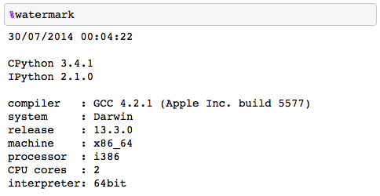

watermark
=========

An IPython magic extension for printing date and time stamps, version numbers, and hardware information

**watermark is now located and maintained in a separate GitHub repository:** [https://github.com/rasbt/watermark](https://github.com/rasbt/watermark)