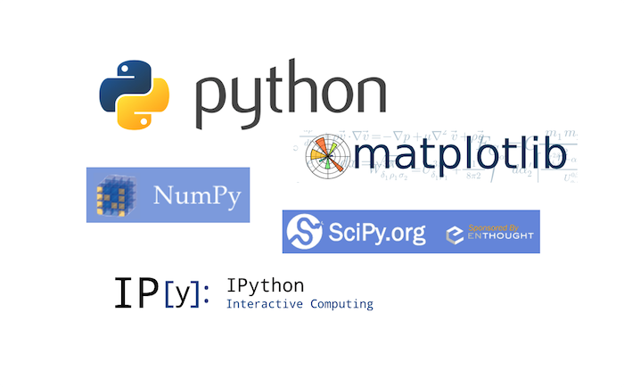

## Installing Scientific Packages for Python3 on MacOS 10.9 Mavericks

_\-- written by Sebastian Raschka_ on March 13, 2014

  
  

* * *

#### Sections

• Anaconda and Miniconda  
• Consider a virtual environment  
• Installing pip  
• Installing NumPy  
• Installing SciPy  
• Installing matplotlib  
• Installing IPython  
• Updating installed packages  

  

* * *

  

  
  

## Anaconda and Miniconda

  

Alternatively, instead of going through all the manual steps listed in the
following sections, there is the [Anaconda Python
distribution](https://store.continuum.io/cshop/anaconda/) for scientific
computing. Although Anaconda is distributed by Continuum Analytics, it is
completely free and includes more than 125 packages for science and data
analysis.  
The installation procedure is nicely summarized here:
<http://docs.continuum.io/anaconda/install.html>

If this is too much, the [Miniconda](http://repo.continuum.io/miniconda/)
might be right for you. Miniconda is basically just a Python distribution with
the Conda package manager, which let's us install a list of Python packages
into a specified conda environment.

    
    
    $[bash]> conda create -n myenv python=3
    $[bash]> conda install -n myenv numpy scipy matplotlib ipython
    

Note: environments will be created in `ROOT_DIR/envs` by default, you can use
the `-p` instead of the `-n` flag in the conda commands above in order to
specify a custom path.

If you we decided pro Anaconda or Miniconda, we are basically done at this
point. The following sections are explaining a more (semi)-manual approach to
install the packages individually using `pip`.

  
  

## Consider a virtual environment

  
In order to not mess around with our system packages, we should consider
setting up a virtual environment when we want to install the additional
scientific packages.  
To set up a new virtual environment, we can use the following command

    
    
    $[bash]> python3 -m venv /path_to/my_virtual_env
    

and activate it via

    
    
    $[bash]> source /path_to/my_virtual_env/bin/activate
    

  
  

## Installing pip

  
`pip` is a tool for installing and managing Python packages. It makes the
installation process for Python packages a lot easier, since they don't have
to be downloaded manually.  
If you haven't installed the `pip` package for your version of Python, yet,
I'd suggest to download it from <https://pypi.python.org/pypi/pip>, unzip it,
and install it from the unzipped directory via

    
    
    $[bash]> python3 setup.py install
    

  
  

## Installing NumPy

  
Installing NumPy should be straight forward now using `pip`

    
    
    $[bash]> python3 -m pip install numpy
    

The installation will probably take a few minutes due to the source files that
have to be compiled for your machine. Once it is installed, `NumPy` should be
available in Python via

    
    
    >> import numpy
    

If you want to see a few examples of how to operate with NumPy arrays, you can
check out my [Matrix Cheatsheet for Moving from MATLAB matrices to NumPy
arrays](http://sebastianraschka.com/Articles/2014_matlab_vs_numpy.html)

  
  

## Installing SciPy

  
While the `clang` compiler worked fine for compiling the C source code for
`numpy`, we now need an additional Fortran compiler in order to install
`scipy`.

  

#### Installing a Fortran Compiler

Unfortunately, MacOS 10.9 Mavericks doesn't come with a Fortran compiler, but
it is pretty easy to download and install one.  
For example, `gfortran` for MacOS 10.9 can be downloaded from
<http://coudert.name/software/gfortran-4.8.2-Mavericks.dmg>

Just double-click on the downloaded .DMG container and follow the familiar
MacOS X installation procedure. Once it is installed, the `gfortran` compiler
should be available from the command line,. We can test it by typing

    
    
    $[bash]> gfortran -v
    

Among other information, we will see the current version, e.g.,

    
    
    gcc version 4.8.2 (GCC)

  

#### Installing SciPy

Now, we should be good to go to install `SciPy` using `pip`.

    
    
    $[bash]> python3 -m pip install scipy
    

After it was successfully installed - might also take a couple of minutes due
to the source code compilation - it should be available in Python via

    
    
    >> import scipy
    

  
  

## Installing matplotlib

  
The installation process for matplotlib should go very smoothly using `pip`, I
haven't encountered any hurdles here.

    
    
    $[bash]> python3 -m pip install matplotlib
    

After successful installation, it can be imported in Python via

    
    
    >> import matplotlib
    

The `matplotlib` library has become my favorite data plotting tool recently,
you can check out some examples in my little matplotlib-gallery on GitHub:
<https://github.com/rasbt/matplotlib_gallery>

  
  

## Installing IPython

  

#### Installing pyzmq

The IPython kernel requires the `pyzmq` package to run, `pyzmq` contains
Python bindings for ØMQ, which is a lightweight and fast messaging
implementation. It can be installed via `pip`.

    
    
    $[bash]> python3 -m pip install pyzmq
    

  

#### Installing pyside

When I was trying to install the `pyside` package, I had it complaining about
the missing `cmake`. It can be downloaded from:

<http://www.cmake.org/files/v2.8/cmake-2.8.12.2-Darwin64-universal.dmg>

Just as we did with `gfortran` in the Installing SciPy section, double-click
on the downloaded .DMG container and follow the familiar MacOS X installation
procedure.  
We can confirm that it was successfully installed by typing

    
    
    $[bash]> cmake --version
    

into the command line where it would print something like

    
    
    cmake version 2.8.12.2

  

#### Installing IPython

Now, we should finally be able to install IPython with all its further
dependencies (pygments, Sphinx, jinja2, docutils, markupsafe) via

    
    
    $[bash]> python3 -m pip install ipython[all]
    

By doing this, we would install IPython to a custom location, e.g.,
`/Library/Frameworks/Python.framework/Versions/3.3/lib/python3.3/site-
packages/IPython`.

You can find the path to this location by importing IPython in Python and then
print its path:

    
    
    >> import IPython
    >> IPython.__path__
    

Finally, we can set an `alias` in our `.bash_profile` or `.bash_rc` file to
conviniently run IPython from the console. E.g.,

    
    
    alias ipython3="python3 /Library/Frameworks/Python.framework/Versions/3.3/lib/python3.3/site-packages/IPython/terminal/ipapp.py"

(Don't forget to `source` the `.bash_rc` or `.bash_profile` file afterwards)

Now we can run

    
    
    $[bash]> ipython3
    

from you shell terminal to launch the interactive IPython shell, and

    
    
    $[bash]> ipython3 notebook
    

to bring up the awesome IPython notebook in our browser, respectively.

  
  

## Updating installed packages

  
Finally, if we want to keep our freshly installed packages up to date, we'd
run `pip` with the `\--upgrade` flag, for example

    
    
    $[bash]> python3 -m pip install numpy --upgrade 
    

  

