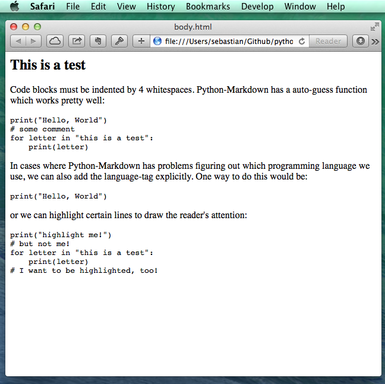
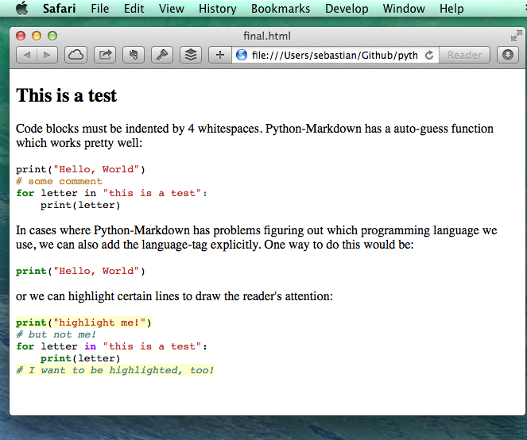

[Sebastian Raschka](http://sebastianraschka.com)  

last updated: 05/28/2014

I would be happy to hear your comments and suggestions.  
Please feel free to drop me a note via
[twitter](https://twitter.com/rasbt), [email](mailto:bluewoodtree@gmail.com), or [google+](https://plus.google.com/118404394130788869227).

# 5 simple steps for converting Markdown documents into HTML and adding Python syntax highlighting

 
 

In this little tutorial, I want to show you in 5 simple steps how easy it is to add code syntax highlighting to your blog articles. 

There are more sophisticated approaches using static site generators, e.g., [nikola](https://github.com/getnikola/nikola), but the focus here is to give you the brief introduction of how it generally works.

All the files I will be using as examples in this tutorial can be download from the GitHub repository [/rasbt/python_reference/tutorials/markdown_syntax_highlighting](https://github.com/rasbt/python_reference/tree/master/tutorials/markdown_syntax_highlighting)

 
 

##1 - Installing packages

The two packages that we will use are

- [Python-Markdown](http://pythonhosted.org/Markdown/)

- [Pygments](http://pygments.org)

Just as the name suggests, Python-Markdown is the Python package that we will use for the Markdown to HTML conversion. 
The second library, Pygments, will be used to add the syntax highlighting to the code blocks.  
Conveniently, both libraries can be installed via `pip`:

	pip install markdown
	
and

	pip install Pygments

(For alternative ways to install the Python-Markdown package, please see [the
documentation](http://pythonhosted.org/Markdown/install.html))
	

 
 

##2 - Writing a Markdown document

Now, let us compose a simple Markdown document including some Python code blocks in any/our favorite Markdown editor. 

--> [**some_markdown.md**](https://github.com/rasbt/python_reference/blob/master/tutorials/markdown_syntax_highlighting/some_markdown.md)

<pre>

##This is a test

Code blocks must be indented by 4 whitespaces.
Python-Markdown has a auto-guess function which works
pretty well:

    print("Hello, World")
	# some comment
    for letter in "this is a test":
        print(letter)

In cases where Python-Markdown has problems figuring out which
programming language we use, we can also add the language-tag
explicitly. One way to do this would be:

    :::python
    print("Hello, World")

or we can highlight certain lines to 
draw the reader's attention:

    :::python hl_lines="1 5"
	print("highlight me!")
	# but not me!
    for letter in "this is a test":
        print(letter)   
    # I want to be highlighted, too!
         
</pre>  

 
 

Note that the syntax highlighting does not only work for Python, but other programming languages.

So in the case of C++, for example:

	:::c++
	#include <iostream>
 
	int main()
	{
	    std::cout << "Hello, world!" << std::endl;
 	   return 0;
	}
    

Since the CodeHilite extension in Python-Markdown uses Pygments, every programming language that is [listed here](http://pygments.org/languages/) currently has support for syntax highlighting.

 
  
 
## 3 - Converting the Markdown document to HTML 
 

After we created our Markdown document, we are going to use Python-Markdown directly from the command line to convert it into an HTML document.
 
Note that we can also import Python-Markdown as a module in our Python scripts, and it comes with a rich repertory of different functions, which are [listed in the library reference](https://pythonhosted.org/Markdown/reference.html).  
 
The basic command line usage to convert a Markdown document into HTML would be:

	python -m markdown input.md > output.html
	
However, since we want to have syntax highlighting for our Python code, we will use Python-Markdown's [CodeHilite extension](http://pythonhosted.org/Markdown/extensions/code_hilite.html) by providing an additional `-x codehilite` argument on the command line:  

	python -m markdown -x codehilite some_markdown.md > body.html
 
This will create the HTML body with our Markdown code converted to HTML with the Python code blocks annotated for the syntax highlighting.

 
 

##4 - Generating the CSS   

If we open the [**body.html**](https://github.com/rasbt/python_reference/blob/master/tutorials/markdown_syntax_highlighting/body.html) file now, which we have created in the previous section, we will notice that it doesn't have the Python code colored yet.

What is missing is the CSS code for adding the colors to our annotated Python code block. But we can simply create such a CSS file via `Pygments` from the command line.
 
	pygmentize -S default -f html > codehilite.css  
	
Note that we usually only need to create the [**codehilite.css**](https://github.com/rasbt/python_reference/blob/master/tutorials/markdown_syntax_highlighting/codehilite.css) file once and insert a link in all our HTML files that we created via Python-Markdown to get the syntax coloring

 
 
  
 
 
## 5 - Insert into your HTML body
 

In order to include a link to the [codehilite.css](https://github.com/rasbt/python_reference/blob/master/tutorials/markdown_syntax_highlighting/codehilite.css) file for syntax coloring in our converted HTML file, we have to add the following line to the header section. 

`<link rel="stylesheet" type="text/css" href="./codehilite.css">`

Now, we can insert the HTML body ([body.html](https://github.com/rasbt/python_reference/blob/master/tutorials/markdown_syntax_highlighting/body.html)), which was created from our Markdown document, directly into our final HTML file (e.g., our blog article template).

[**template.html**](https://github.com/rasbt/python_reference/blob/master/tutorials/markdown_syntax_highlighting/template.html): 
 
<code>
	
	<!DOCTYPE html>
	<html lang="en">

	<head>
	<meta charset="utf-8">
	<link rel="stylesheet" type="text/css" href="./codehilite.css">
	</head>

	<body>

	<-- converted HTML contents go here

	</body>
	</html>

</code> 

If we open our [**final.html**](https://github.com/rasbt/python_reference/blob/master/tutorials/markdown_syntax_highlighting/template.html) file in our web browser now, we can the pretty Python syntax highlighting.

 
 

## Useful links:

- [Python Markdown package documentation](http://pythonhosted.org//Markdown/)

- [The CodeHilite documentation](https://pythonhosted.org/Markdown/extensions/code_hilite.html)

- [pygments.org](http://pygments.org)

- [languages supported](http://pygments.org/languages/) by Pygments

