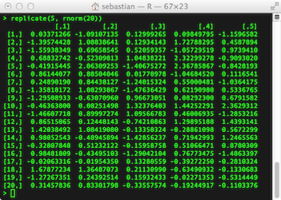
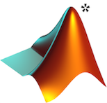
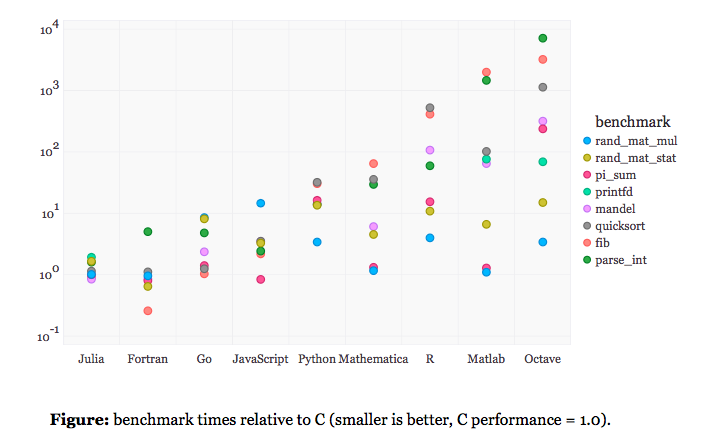

<link rel="stylesheet" type="text/css" href="../CSS/hover.css" media="screen" />

# Numeric matrix manipulation - The cheat sheet for MATLAB, Python NumPy, R, and Julia

At its core, this article is about a simple cheat sheet for basic operations on numeric matrices, which can be very useful if you working and experimenting with some of the most popular languages that are used for scientific computing, statistics, and data analysis.

## Sections

- [Introduction](#introduction)

- [Language overview](#overview)

	- [MATLAB/Octave](#matlab)
	
	- [Python NumPy](#numpy)
	
	- [R](#r)
	
	- [Julia](#julia)

- [Matrix cheat sheet](#cheatsheet)

- [Alternative data structures: NumPy matrices vs. NumPy arrays](#numpy_arrays)

 

## Introduction

[[back to section overview](#sections)]
 

Matrices (or multidimensional arrays) are not only presenting the fundamental elements of many algebraic equations that are used in many popular fields, such as pattern classification, machine learning, data mining, and math and engineering in general. But in context of scientific computing, they also come in very handy for managing and storing data in an more organized tabular form.  
Such multidimensional data structures are also very powerful performance-wise thanks to the concept of automatic vectorization: instead of the individual and sequential processing of operations on scalars in loop-structures, the whole computation can be parallelized in order to make optimal use of modern computer architectures.  

 

 
 

**Note:**  
This article originated from an older article with containing a cheat sheet that was just about MATLAB matrices and NumPy arrays. Since then, I added a couple of more rows and doubled the width of the cheat sheet by adding those two other languages R and Julia. Instead of making further modifications, I wanted to keep this old article as is - for future reference and for people who may only be interested in this slimmer version:  
[Moving from MATLAB matrices to NumPy arrays - A Matrix Cheatsheet](http://sebastianraschka.com/Articles/2014_matlab_vs_numpy.html).

 
 

### Language overview

[[back to section overview](#sections)]
 

Before we **[jump to the actual cheat sheet](#cheatsheet)**, I wanted to give you at least a brief overview of the different languages that we are dealing with.

All four languages, MATLAB/Octave, Python, R, and Julia are dynamically typed, have a command line interface for the interpreter, and come with great number of additional and useful libraries to support scientific and technical computing. Conveniently, these languages also offer great solutions for easy plotting and visualizations.  

Combined with interactive notebook interfaces or dynamic report generation engines ([MuPAD](http://www.mathworks.com/discovery/mupad.html) for MATLAB, [IPython Notebook](http://ipython.org/notebook.html) for Python, [knitr](http://yihui.name/knitr/) for R, and [IJulia](https://github.com/JuliaLang/IJulia.jl) for Julia based on IPython Notebook) data analysis and documentation has never been easier.

 
 

# MATLAB/Octave

[[back to section overview](#sections)]
 

 

 

[MATLAB](http://www.mathworks.com/products/matlab/) (stands for MATrix LABoratory) is the name of an application and language that was developed by [MathWorks](http://www.mathworks.com/index.html?s_tid=gn_logo) back in 1984. One of its strengths is the variety of different and highly optimized "toolboxes" (including very powerful functions for image and other signal processing task), which makes suitable for tackling basically every possible science and engineering task.  
Like the other languages, which will be covered in this article, it has cross-platform support and is using dynamic types, which allows for a convenient interface, but can also be quite "memory hungry" for computations on large data sets.

Even today, MATLAB is probably (still) the most popular language for numeric computation used for engineering tasks in academia as well as in industry.

#### GNU Octave

 

 

It is also worth mentioning that MATLAB is the only language in this cheat sheet which is not free and open-sourced. But since it is so immensely popular, I want to mention it nonetheless. And as an alternative there is also the free [GNU Octave re-implementation](http://www.gnu.org/software/octave/) that follows the same syntactic rules so that the code is compatible to MATLAB (except for very specialized libraries).

 

* This [image](http://commons.wikimedia.org/wiki/File:Matlab_Logo.png) is a freely usable media under public domain and represents the first eigenfunction of the L-shaped membrane, resembling (but not identical to) MATLAB's logo trademarked by MathWorks Inc.

 
 

# Python NumPy

[[back to section overview](#sections)]
 

 

 

Initially, the [NumPy](http://www.numpy.org) project started out under the name "Numeric" in 1995 (renamed to NumPy in 2006) as a Python library for numeric computations based on multi-dimensional data structures, such as arrays and matrices. Since it makes use of pre-compiled C code for operations on its "`ndarray`" objects, it is considerably faster than using equivalent approaches in (C)Python.

Python NumPy is my personal favorite since I am a big fan of the Python programming language. Although similar tools exist for other languages, I found myself to be most productive doing my research and data analyses in [IPython notebooks](http://ipython.org/notebook.html).  
It allows me to easily combine Python code (sometimes optimized by compiling it via the [Cython](http://cython.org) C-Extension or the just-in-time (JIT) [Numba](http://numba.pydata.org) compiler if speed is a concern) with different libraries from the [Scipy stack](http://www.scipy.org/) including [matplotlib](http://matplotlib.org) for inline data visualization (you can find some of my example benchmarks in this [GitHub repository](http://github.com/rasbt/One-Python-benchmark-per-day)).

 
 

# R

[[back to section overview](#sections)]
 

 

 

The [R](http://www.r-project.org) programming language was developed in 1993 and is a modern GNU implementation of an older statistical programming language called [S](http://stat.bell-labs.com/S/), which was developed in the [Bell Laboratories](http://stat.bell-labs.com) in 1976. Since its release, it has a fast-growing user base and is particularly popular among statisticians.  

R was also the first language which kindled my fascination for statistics and computing. I have used it quite extensively a couple of years ago before I discovered Python as my new favorite language for data analysis.  
Although R has great in-built functions for performing all sorts statistics, as well as a plethora of freely available libraries developed by the large R community, I often hear people complaining about its rather unintuitive syntax.

 
 

# Julia

[[back to section overview](#sections)]
 

 

 

With its first release in 2012, [Julia](http://julialang.org) is by far the youngest of the programming languages mentioned in this article.  a
While Julia can also be used as an interpreted language with dynamic types from the command line, it aims for high-performance in scientific computing that is superior to the other dynamic programming languages for technical computing thanks to its LLVM-based just-in-time (JIT) compiler.

Personally, I haven't used Julia that extensively, yet, but there are some exciting benchmarks that look very promising:

C compiled by gcc 4.8.1, taking best timing from all optimization levels (-O0 through -O3). C, Fortran and Julia use OpenBLAS v0.2.8. The Python implementations of rand_mat_stat and rand_mat_mul use NumPy (v1.6.1) functions; the rest are pure Python implementations. 

Bezanson, J., Karpinski, S., Shah, V.B. and Edelman, A. (2012), “Julia: A fast dynamic language for technical computing”.  
(Source: [http://julialang.org/benchmarks/](http://julialang.org/benchmarks/), with permission from the copyright holder)

 
 
 

 

# Cheat sheet

 

 <a href='#cheat_overview'>[back to cheat sheet overview]

### Cheat sheet overview

- [Creating matrices](#creating)

- Accessing matrix elements

- Manipulating shape

- Basic matrix operations

- Advanced matrix operations

 
 
 
 

<table cellspacing="0" border="0">
	<colgroup width="383"></colgroup>
	<colgroup width="387"></colgroup>
	<colgroup width="447"></colgroup>
	<colgroup width="469"></colgroup>
	<colgroup width="511"></colgroup>
	<colgroup width="690"></colgroup>
	<tr>
		<td height="57" align="center" valign=middle bgcolor="#0066CC"><b>Task</b></td>
		<td align="center" valign=middle bgcolor="#0066CC"><b>MATLAB/Octave</b></td>
		<td align="center" valign=middle bgcolor="#0066CC"><b>Python NumPy</b></td>
		<td align="center" valign=middle bgcolor="#0066CC"><b>R</b></td>
		<td align="center" valign=middle bgcolor="#0066CC"><b>Julia</b></td>
		<td align="center" valign=middle bgcolor="#0066CC"><b>Task</b></td>
	</tr>
	<tr> 
		<td colspan=6 height="70" align="center" valign=middle bgcolor="#FFFFFF"><b>CREATING MATRICES <a href='#cheat_overview'>[back to cheat sheet overview]</a></b></td>
		</tr>		
	<tr>
		<td style="border-right: 1px solid #000000" height="158" align="left" valign=top bgcolor="#FFFFFF"><b>Creating Matrices&nbsp; (here: 3x3 matrix)</b></td>
		<td style="border-right: 1px dotted #000000" align="left" valign=top bgcolor="#FFFFFF">M&gt; A = [1 2 3; 4 5 6; 7 8 9] A = &nbsp;&nbsp; 1 &nbsp; 2 &nbsp; 3 &nbsp;&nbsp; 4 &nbsp; 5 &nbsp; 6 &nbsp;&nbsp; 7 &nbsp; 8 &nbsp; 9</td>
		<td style="border-left: 1px dotted #000000; border-right: 1px dotted #000000" align="left" valign=top bgcolor="#FFFFFF">P&gt; A = np.array([ [1,2,3], [4,5,6], [7,8,9] ])  P&gt; A array([[1, 2, 3], &nbsp;&nbsp; &nbsp; &nbsp; [4, 5, 6], &nbsp;&nbsp; &nbsp; &nbsp; [7, 8, 9]])</td>
		<td style="border-left: 1px dotted #000000; border-right: 1px dotted #000000" align="left" valign=top bgcolor="#FFFFFF">R&gt; A = matrix(c(1,2,3,4,5,6,7,8,9),nrow=3,byrow=T) 
# equivalent to
 # A = matrix(1:9,nrow=3,byrow=T)

  R&gt; A      [,1] [,2] [,3] [1,]    1    2    3 [2,]    4    5    6 [3,]    7    8    9</td>
		<td style="border-left: 1px dotted #000000" align="left" valign=top bgcolor="#FFFFFF">J&gt; A=[1 2 3; 4 5 6; 7 8 9] 3x3 Array{Int64,2}:  1  2  3  4  5  6  7  8  9</td>
		<td style="border-left: 1px solid #000000; border-right: 1px solid #000000" align="left" valign=top bgcolor="#FFFFFF"><b>Creating Matrices&nbsp; (here: 3x3 matrix)</b></td>
	</tr>
	<tr>
		<td style="border-right: 1px solid #000000" height="128" align="left" valign=top bgcolor="#CFE7F5"><b>Creating an 1D column vector</b></td>
		<td style="border-right: 1px dotted #000000" align="left" valign=top bgcolor="#CFE7F5">M&gt; a = [1; 2; 3] a = &nbsp;&nbsp; 1 &nbsp;&nbsp; 2 &nbsp;&nbsp; 3</td>
		<td style="border-left: 1px dotted #000000; border-right: 1px dotted #000000" align="left" valign=top bgcolor="#CFE7F5">P&gt; a = np.array([[1],[2],[3]]) P&gt; a array([[1], &nbsp;&nbsp; &nbsp; &nbsp; [2], &nbsp;&nbsp; &nbsp; &nbsp; [3]])</td>
		<td style="border-left: 1px dotted #000000; border-right: 1px dotted #000000" align="left" valign=top bgcolor="#CFE7F5">R&gt; a = matrix(c(1,2,3), nrow=3, byrow=T) R&gt; a      [,1] [1,]    1 [2,]    2 [3,]    3 R&gt;</td>
		<td style="border-left: 1px dotted #000000" align="left" valign=top bgcolor="#CFE7F5">J&gt; a=[1; 2; 3] 3-element Array{Int64,1}:    1  2  3</td>
		<td style="border-left: 1px solid #000000; border-right: 1px solid #000000" align="left" valign=top bgcolor="#CFE7F5"><b>Creating an 1D column vector</b></td>
	</tr>
	<tr>
		<td style="border-right: 1px solid #000000" height="128" align="left" valign=top bgcolor="#FFFFFF"><b>Creating an 1D row vector</b></td>
		<td style="border-right: 1px dotted #000000" align="left" valign=top bgcolor="#FFFFFF">M&gt; b = [1 2 3] b = &nbsp;&nbsp; 1 &nbsp; 2 &nbsp; 3</td>
		<td style="border-left: 1px dotted #000000; border-right: 1px dotted #000000" align="left" valign=top bgcolor="#FFFFFF">P&gt; b = np.array([1,2,3])  P&gt; b array([1, 2, 3])</td>
		<td style="border-left: 1px dotted #000000; border-right: 1px dotted #000000" align="left" valign=top bgcolor="#FFFFFF">R&gt; b = matrix(c(1,2,3), ncol=3)  R&gt; b      [,1] [,2] [,3] [1,]    1    2    3</td>
		<td style="border-left: 1px dotted #000000" align="left" valign=top bgcolor="#FFFFFF">J&gt; b=[1 2 3]   1x3 Array{Int64,2}:  1  2  3  # note that this is a 2D array. # vectors in Julia are columns</td>
		<td style="border-left: 1px solid #000000; border-right: 1px solid #000000" align="left" valign=top bgcolor="#FFFFFF"><b>Creating an 1D row vector</b></td>
	</tr>
	<tr>
		<td style="border-right: 1px solid #000000" height="128" align="left" valign=top bgcolor="#CFE7F5"><b>Creating a  random m x n matrix</b></td>
		<td style="border-right: 1px dotted #000000" align="left" valign=top bgcolor="#CFE7F5">M&gt; rand(3,2) ans = &nbsp;&nbsp; 0.21977 &nbsp; 0.10220 &nbsp;&nbsp; 0.38959 &nbsp; 0.69911 &nbsp;&nbsp; 0.15624 &nbsp; 0.65637</td>
		<td style="border-left: 1px dotted #000000; border-right: 1px dotted #000000" align="left" valign=top bgcolor="#CFE7F5">P&gt; np.random.rand(3,2) array([[ 0.29347865,&nbsp; 0.17920462], &nbsp;&nbsp; &nbsp; &nbsp; [ 0.51615758,&nbsp; 0.64593471], &nbsp;&nbsp; &nbsp; &nbsp; [ 0.01067605,&nbsp; 0.09692771]])</td>
		<td style="border-left: 1px dotted #000000; border-right: 1px dotted #000000" align="left" valign=top bgcolor="#CFE7F5">R&gt; matrix(runif(3*2), ncol=2)           [,1]      [,2] [1,] 0.5675127 0.7751204 [2,] 0.3439412 0.5261893 [3,] 0.2273177 0.223438</td>
		<td style="border-left: 1px dotted #000000" align="left" valign=top bgcolor="#CFE7F5">J&gt; rand(3,2) 3x2 Array{Float64,2}:  0.36882   0.267725  0.571856  0.601524  0.848084  0.858935</td>
		<td style="border-left: 1px solid #000000; border-right: 1px solid #000000" align="left" valign=top bgcolor="#CFE7F5"><b>Creating a  random m x n matrix</b></td>
	</tr>
	<tr>
		<td style="border-right: 1px solid #000000" height="128" align="left" valign=top bgcolor="#FFFFFF"><b>Creating a zero&nbsp;m x n matrix&nbsp;</b></td>
		<td style="border-right: 1px dotted #000000" align="left" valign=top bgcolor="#FFFFFF">M&gt; zeros(3,2) ans = &nbsp;&nbsp; 0 &nbsp; 0 &nbsp;&nbsp; 0 &nbsp; 0 &nbsp;&nbsp; 0 &nbsp; 0</td>
		<td style="border-left: 1px dotted #000000; border-right: 1px dotted #000000" align="left" valign=top bgcolor="#FFFFFF">P&gt; np.zeros((3,2)) array([[ 0.,&nbsp; 0.], &nbsp;&nbsp; &nbsp; &nbsp; [ 0.,&nbsp; 0.], &nbsp;&nbsp; &nbsp; &nbsp; [ 0.,&nbsp; 0.]])</td>
		<td style="border-left: 1px dotted #000000; border-right: 1px dotted #000000" align="left" valign=top bgcolor="#FFFFFF">R&gt; mat.or.vec(3, 2)      [,1] [,2] [1,]    0    0 [2,]    0    0 [3,]    0    0</td>
		<td style="border-left: 1px dotted #000000" align="left" valign=top bgcolor="#FFFFFF">J&gt; zeros(3,2) 3x2 Array{Float64,2}:  0.0  0.0  0.0  0.0  0.0  0.0</td>
		<td style="border-left: 1px solid #000000; border-right: 1px solid #000000" align="left" valign=top bgcolor="#FFFFFF"><b>Creating a zero&nbsp;m x n matrix&nbsp;</b></td>
	</tr>
	<tr>
		<td style="border-right: 1px solid #000000" height="128" align="left" valign=top bgcolor="#CFE7F5"><b>Creating an m x n matrix of ones</b></td>
		<td style="border-right: 1px dotted #000000" align="left" valign=top bgcolor="#CFE7F5">M&gt; ones(3,2) ans = &nbsp;&nbsp; 1 &nbsp; 1 &nbsp;&nbsp; 1 &nbsp; 1 &nbsp;&nbsp; 1 &nbsp; 1</td>
		<td style="border-left: 1px dotted #000000; border-right: 1px dotted #000000" align="left" valign=top bgcolor="#CFE7F5">P&gt; np.ones([3,2]) array([[ 1.,&nbsp; 1.], &nbsp;&nbsp; &nbsp; &nbsp; [ 1.,&nbsp; 1.], &nbsp;&nbsp; &nbsp; &nbsp; [ 1.,&nbsp; 1.]])</td>
		<td style="border-left: 1px dotted #000000; border-right: 1px dotted #000000" align="left" valign=top bgcolor="#CFE7F5">R&gt; mat.or.vec(3, 2) + 1      [,1] [,2] [1,]    1    1 [2,]    1    1 [3,]    1    1</td>
		<td style="border-left: 1px dotted #000000" align="left" valign=top bgcolor="#CFE7F5">J&gt; ones(3,2) 3x2 Array{Float64,2}:  1.0  1.0  1.0  1.0  1.0  1.0</td>
		<td style="border-left: 1px solid #000000; border-right: 1px solid #000000" align="left" valign=top bgcolor="#CFE7F5"><b>Creating an m x n matrix of ones</b></td>
	</tr>
	<tr>
		<td style="border-right: 1px solid #000000" height="128" align="left" valign=top bgcolor="#FFFFFF"><b>Creating an identity matrix</b></td>
		<td style="border-right: 1px dotted #000000" align="left" valign=top bgcolor="#FFFFFF">M&gt; eye(3) ans = Diagonal Matrix &nbsp;&nbsp; 1 &nbsp; 0 &nbsp; 0 &nbsp;&nbsp; 0 &nbsp; 1 &nbsp; 0 &nbsp;&nbsp; 0 &nbsp; 0 &nbsp; 1</td>
		<td style="border-left: 1px dotted #000000; border-right: 1px dotted #000000" align="left" valign=top bgcolor="#FFFFFF">P&gt; np.eye(3) array([[ 1.,&nbsp; 0.,&nbsp; 0.], &nbsp;&nbsp; &nbsp; &nbsp; [ 0.,&nbsp; 1.,&nbsp; 0.], &nbsp;&nbsp; &nbsp; &nbsp; [ 0.,&nbsp; 0.,&nbsp; 1.]])</td>
		<td style="border-left: 1px dotted #000000; border-right: 1px dotted #000000" align="left" valign=top bgcolor="#FFFFFF">R&gt; diag(3)      [,1] [,2] [,3] [1,]    1    0    0 [2,]    0    1    0 [3,]    0    0    1</td>
		<td style="border-left: 1px dotted #000000" align="left" valign=top bgcolor="#FFFFFF">J&gt; eye(3) 3x3 Array{Float64,2}:  1.0  0.0  0.0  0.0  1.0  0.0  0.0  0.0  1.0</td>
		<td style="border-left: 1px solid #000000; border-right: 1px solid #000000" align="left" valign=top bgcolor="#FFFFFF"><b>Creating an identity matrix</b></td>
	</tr>
	<tr>
		<td style="border-right: 1px solid #000000" height="217" align="left" valign=top bgcolor="#CFE7F5"><b>Creating a diagonal matrix</b></td>
		<td style="border-right: 1px dotted #000000" align="left" valign=top bgcolor="#CFE7F5">M&gt; a = [1 2 3]  M&gt; diag(a) ans = Diagonal Matrix &nbsp;&nbsp; 1 &nbsp; 0 &nbsp; 0 &nbsp;&nbsp; 0 &nbsp; 2 &nbsp; 0 &nbsp;&nbsp; 0 &nbsp; 0 &nbsp; 3</td>
		<td style="border-left: 1px dotted #000000; border-right: 1px dotted #000000" align="left" valign=top bgcolor="#CFE7F5">P&gt; a = np.array([1,2,3])  P&gt; np.diag(a) array([[1, 0, 0], &nbsp;&nbsp; &nbsp; &nbsp; [0, 2, 0], &nbsp;&nbsp; &nbsp; &nbsp; [0, 0, 3]])</td>
		<td style="border-left: 1px dotted #000000; border-right: 1px dotted #000000" align="left" valign=top bgcolor="#CFE7F5">R&gt; diag(1:3)      [,1] [,2] [,3] [1,]    1    0    0 [2,]    0    2    0 [3,]    0    0    3</td>
		<td style="border-left: 1px dotted #000000" align="left" valign=top bgcolor="#CFE7F5">J&gt; a=[1, 2, 3]   # added commas because julia # vectors are columnar  J&gt; diagm(a) 3x3 Array{Int64,2}:  1  0  0  0  2  0  0  0  3</td>
		<td style="border-left: 1px solid #000000; border-right: 1px solid #000000" align="left" valign=top bgcolor="#CFE7F5"><b>Creating a diagonal matrix</b></td>
	</tr>
	<tr>
		<td colspan=6 height="128" align="center" valign=middle bgcolor="#FFFFFF"><b>ACESSING MATRIX ELEMENTS</b></td>
		</tr>
	<tr>
		<td style="border-right: 1px solid #000000" height="159" align="left" valign=top bgcolor="#FFFFFF"><b>Getting the dimension of a matrix (here: 2D, rows x cols)</b></td>
		<td style="border-right: 1px dotted #000000" align="left" valign=top bgcolor="#FFFFFF">M&gt; A = [1 2 3; 4 5 6] A = &nbsp; &nbsp;1 &nbsp; 2 &nbsp; 3 &nbsp; &nbsp;4 &nbsp; 5 &nbsp; 6  M&gt; size(A) ans = &nbsp; &nbsp;2 &nbsp; 3</td>
		<td style="border-left: 1px dotted #000000; border-right: 1px dotted #000000" align="left" valign=top bgcolor="#FFFFFF">P&gt; A = np.array([ [1,2,3], [4,5,6] ])  P&gt; A array([[1, 2, 3], &nbsp; &nbsp; &nbsp; &nbsp;[4, 5, 6]])  P&gt; A.shape (2, 3)</td>
		<td style="border-left: 1px dotted #000000; border-right: 1px dotted #000000" align="left" valign=top bgcolor="#FFFFFF">R&gt; A = matrix(1:6,nrow=2,byrow=T)  R&gt; A      [,1] [,2] [,3] [1,]    1    2    3 [2,]    4    5    6
R&gt; dim(A) [1] 2 3</td>
		<td style="border-left: 1px dotted #000000" align="left" valign=top bgcolor="#FFFFFF">J&gt; A=[1 2 3; 4 5 6] 2x3 Array{Int64,2}:  1  2  3  4  5  6  J&gt; size(A) (2,3)</td>
		<td style="border-left: 1px solid #000000; border-right: 1px solid #000000" align="left" valign=top bgcolor="#FFFFFF"><b>Getting the dimension of a matrix (here: 2D, rows x cols)</b></td>
	</tr>
	<tr>
		<td style="border-right: 1px solid #000000" height="240" align="left" valign=top bgcolor="#CFE7F5"><b>Selecting rows&nbsp;</b></td>
		<td style="border-right: 1px dotted #000000" align="left" valign=top bgcolor="#CFE7F5">M&gt; A = [1 2 3; 4 5 6; 7 8 9]  % 1st row M&gt; A(1,:) ans = &nbsp;&nbsp; 1 &nbsp; 2 &nbsp; 3  % 1st 2 rows M&gt; A(1:2,:) ans = &nbsp;&nbsp; 1 &nbsp; 2 &nbsp; 3 &nbsp;&nbsp; 4 &nbsp; 5 &nbsp; 6</td>
		<td style="border-left: 1px dotted #000000; border-right: 1px dotted #000000" align="left" valign=top bgcolor="#CFE7F5">P&gt; A = np.array([ [1,2,3], [4,5,6], [7,8,9] ])  # 1st row P&gt; A[0,:] array([1, 2, 3])  # 1st 2 rows P&gt; A[0:2,:] array([[1, 2, 3], [4, 5, 6]])</td>
		<td style="border-left: 1px dotted #000000; border-right: 1px dotted #000000" align="left" valign=top bgcolor="#CFE7F5">R&gt; A = matrix(1:9,nrow=3,byrow=T)

  # 1st row 

R&gt; A[1,] [1] 1 2 3  

# 1st 2 rows

 R&gt; A[1:2,]      [,1] [,2] [,3] [1,]    1    2    3 [2,]    4    5    6</td>
		<td style="border-left: 1px dotted #000000" align="left" valign=top bgcolor="#CFE7F5">J&gt; A=[1 2 3; 4 5 6; 7 8 9];  #semicolon suppresses output  #1st row J&gt; A[1,:]   1x3 Array{Int64,2}:  1  2  3  #1st 2 rows J&gt; A[1:2,:]   2x3 Array{Int64,2}:  1  2  3  4  5  6</td>
		<td style="border-left: 1px solid #000000; border-right: 1px solid #000000" align="left" valign=top bgcolor="#CFE7F5"><b>Selecting rows&nbsp;</b></td>
	</tr>
	<tr>
		<td style="border-right: 1px solid #000000" height="304" align="left" valign=top bgcolor="#FFFFFF"><b>Selecting columns</b></td>
		<td style="border-right: 1px dotted #000000" align="left" valign=top bgcolor="#FFFFFF">M&gt; A = [1 2 3; 4 5 6; 7 8 9]  % 1st column M&gt; A(:,1) ans = &nbsp;&nbsp; 1 &nbsp;&nbsp; 4 &nbsp;&nbsp; 7  % 1st 2 columns M&gt; A(:,1:2) ans = &nbsp;&nbsp; 1 &nbsp; 2 &nbsp;&nbsp; 4 &nbsp; 5 &nbsp;&nbsp; 7 &nbsp; 8</td>
		<td style="border-left: 1px dotted #000000; border-right: 1px dotted #000000" align="left" valign=top bgcolor="#FFFFFF">P&gt; A = np.array([ [1,2,3], [4,5,6], [7,8,9] ])  # 1st column (as row vector) P&gt; A[:,0] array([1, 4, 7])  # 1st column (as column vector) P&gt; A[:,[0]] array([[1], &nbsp;&nbsp; &nbsp; &nbsp; [4], &nbsp;&nbsp; &nbsp; &nbsp; [7]])  # 1st 2 columns P&gt; A[:,0:2] array([[1, 2],&nbsp; &nbsp; &nbsp; &nbsp; &nbsp;[4, 5],&nbsp; &nbsp; &nbsp; &nbsp; &nbsp;[7, 8]])</td>
		<td style="border-left: 1px dotted #000000; border-right: 1px dotted #000000" align="left" valign=top bgcolor="#FFFFFF">R&gt; A = matrix(1:9,nrow=3,byrow=T)


  # 1st column as row vector
 R&gt; t(A[,1])      [,1] [,2] [,3] [1,]    1    4    7

  # 1st column as column vector
 R&gt; A[,1] [1] 1 4 7

  # 1st 2 columns
 R&gt; A[,1:2]      [,1] [,2] [1,]    1    2 [2,]    4    5 [3,]    7    8</td>
		<td style="border-left: 1px dotted #000000" align="left" valign=top bgcolor="#FFFFFF">J&gt; A=[1 2 3; 4 5 6; 7 8 9];  #1st column J&gt; A[:,1]  3-element Array{Int64,1}:  1  4  7   #1st 2 columns J&gt; A[:,1:2]  3x2 Array{Int64,2}:  1  2  4  5  7  8</td>
		<td style="border-left: 1px solid #000000; border-right: 1px solid #000000" align="left" valign=top bgcolor="#FFFFFF"><b>Selecting columns</b></td>
	</tr>
	<tr>
		<td style="border-right: 1px solid #000000" height="260" align="left" valign=top bgcolor="#CFE7F5"><b>Extracting rows and columns by criteria  (here: get rows&nbsp;that have value 9 in column 3)</b></td>
		<td style="border-right: 1px dotted #000000" align="left" valign=top bgcolor="#CFE7F5">M&gt; A = [1 2 3; 4 5 9; 7 8 9] A = &nbsp;&nbsp; 1 &nbsp; 2 &nbsp; 3 &nbsp;&nbsp; 4 &nbsp; 5 &nbsp; 9 &nbsp;&nbsp; 7 &nbsp; 8 &nbsp; 9  M&gt; A(A(:,3) == 9,:) ans = &nbsp;&nbsp; 4 &nbsp; 5 &nbsp; 9 &nbsp;&nbsp; 7 &nbsp; 8 &nbsp; 9</td>
		<td style="border-left: 1px dotted #000000; border-right: 1px dotted #000000" align="left" valign=top bgcolor="#CFE7F5">P&gt; A = np.array([ [1,2,3], [4,5,9], [7,8,9]])  P&gt; A array([[1, 2, 3], &nbsp;&nbsp; &nbsp; &nbsp; [4, 5, 9], &nbsp;&nbsp; &nbsp; &nbsp; [7, 8, 9]])  P&gt; A[A[:,2] == 9] array([[4, 5, 9], &nbsp;&nbsp; &nbsp; &nbsp; [7, 8, 9]])</td>
		<td style="border-left: 1px dotted #000000; border-right: 1px dotted #000000" align="left" valign=top bgcolor="#CFE7F5">R&gt; A = matrix(1:9,nrow=3,byrow=T)

  R&gt; A      [,1] [,2] [,3] [1,]    1    2    3 [2,]    4    5    9 [3,]    7    8    9

  R&gt; matrix(A[A[,3]==9], ncol=3)      [,1] [,2] [,3] [1,]    4    5    9 [2,]    7    8    9</td>
		<td style="border-left: 1px dotted #000000" align="left" valign=top bgcolor="#CFE7F5">J&gt; A=[1 2 3; 4 5 9; 7 8 9] 3x3 Array{Int64,2}:  1  2  3  4  5  9  7  8  9  # use '.==' for # element-wise check J&gt; A[ A[:,3] .==9, :]   2x3 Array{Int64,2}:  4  5  9  7  8  9</td>
		<td style="border-left: 1px solid #000000; border-right: 1px solid #000000" align="left" valign=top bgcolor="#CFE7F5"><b>Extracting rows and columns by criteria  (here: get rows&nbsp;that have value 9 in column 3)</b></td>
	</tr>
	<tr>
		<td style="border-right: 1px solid #000000" height="118" align="left" valign=top bgcolor="#FFFFFF"><b>Accessing elements (here: 1st element)</b></td>
		<td style="border-right: 1px dotted #000000" align="left" valign=top bgcolor="#FFFFFF">M&gt; A = [1 2 3; 4 5 6; 7 8 9]  M&gt; A(1,1) ans =&nbsp; 1</td>
		<td style="border-left: 1px dotted #000000; border-right: 1px dotted #000000" align="left" valign=top bgcolor="#FFFFFF">P&gt; A = np.array([ [1,2,3], [4,5,6], [7,8,9] ])  P&gt; A[0,0] 1</td>
		<td style="border-left: 1px dotted #000000; border-right: 1px dotted #000000" align="left" valign=top bgcolor="#FFFFFF">R&gt; A = matrix(c(1,2,3,4,5,9,7,8,9),nrow=3,byrow=T)
  
R&gt; A[1,1] [1] 1</td>
		<td style="border-left: 1px dotted #000000" align="left" valign=top bgcolor="#FFFFFF">J&gt; A=[1 2 3; 4 5 6; 7 8 9];  J&gt; A[1,1] 1</td>
		<td style="border-left: 1px solid #000000; border-right: 1px solid #000000" align="left" valign=top bgcolor="#FFFFFF"><b>Accessing elements (here: 1st element)</b></td>
	</tr>
	<tr>
		<td colspan=6 height="128" align="center" valign=middle bgcolor="#FFFFFF"><b>MANIPULATING SHAPE AND DIMENSIONS</b></td>
		</tr>
	<tr>
		<td style="border-right: 1px solid #000000" height="173" align="left" valign=top bgcolor="#CFE7F5"><b>Converting&nbsp; row to column vectors</b></td>
		<td style="border-right: 1px dotted #000000" align="left" valign=top bgcolor="#CFE7F5">M&gt; b = [1 2 3]
  M&gt; b = b' b = &nbsp;&nbsp; 1 &nbsp;&nbsp; 2 &nbsp;&nbsp; 3</td>
		<td style="border-left: 1px dotted #000000; border-right: 1px dotted #000000" align="left" valign=top bgcolor="#CFE7F5">P&gt; b = np.array([1, 2, 3])  P&gt; b = b[np.newaxis].T # alternatively  #&nbsp;b = b[:,np.newaxis]  P&gt; b array([[1], &nbsp;&nbsp; &nbsp; &nbsp; [2], &nbsp;&nbsp; &nbsp; &nbsp; [3]])</td>
		<td style="border-left: 1px dotted #000000; border-right: 1px dotted #000000" align="left" valign=top bgcolor="#CFE7F5">R&gt; b = matrix(c(1,2,3), ncol=3)  R&gt; t(b)      [,1] [1,]    1 [2,]    2 [3,]    3</td>
		<td style="border-left: 1px dotted #000000" align="left" valign=top bgcolor="#CFE7F5">J&gt; b=vec([1 2 3]) 3-element Array{Int64,1}:  1  2  3</td>
		<td style="border-left: 1px solid #000000; border-right: 1px solid #000000" align="left" valign=top bgcolor="#CFE7F5"><b>Converting&nbsp; row to column vectors</b></td>
	</tr>
	<tr>
		<td style="border-right: 1px solid #000000" height="275" align="left" valign=top bgcolor="#FFFFFF"><b>Reshaping Matrices  (here: 3x3 matrix to row vector)</b></td>
		<td style="border-right: 1px dotted #000000" align="left" valign=top bgcolor="#FFFFFF">M&gt; A = [1 2 3; 4 5 6; 7 8 9] A = &nbsp;&nbsp; 1 &nbsp; 2 &nbsp; 3 &nbsp;&nbsp; 4 &nbsp; 5 &nbsp; 6 &nbsp;&nbsp; 7 &nbsp; 8 &nbsp; 9  M&gt; total_elements = numel(A)  M&gt; B = reshape(A,1,total_elements)&nbsp; % or reshape(A,1,9) B = &nbsp;&nbsp; 1 &nbsp; 4 &nbsp; 7 &nbsp; 2 &nbsp; 5 &nbsp; 8 &nbsp; 3 &nbsp; 6 &nbsp; 9</td>
		<td style="border-left: 1px dotted #000000; border-right: 1px dotted #000000" align="left" valign=top bgcolor="#FFFFFF">P&gt; A = np.array([[1,2,3],[4,5,6],[7,8,9]])  P&gt; A array([[1, 2, 3], &nbsp;&nbsp; &nbsp; &nbsp; [4, 5, 9], &nbsp;&nbsp; &nbsp; &nbsp; [7, 8, 9]])  P&gt; total_elements = A.shape[0] * A.shape[1]  P&gt; B = A.reshape(1, total_elements)&nbsp;  # or A.reshape(1,9) # Alternative: A.shape = (1,9)&nbsp; # to&nbsp;change the array in place  P&gt; B array([[1, 2, 3, 4, 5, 6, 7, 8, 9]])</td>
		<td style="border-left: 1px dotted #000000; border-right: 1px dotted #000000" align="left" valign=top bgcolor="#FFFFFF">R&gt; A = matrix(1:9,nrow=3,byrow=T)

  R&gt; A      [,1] [,2] [,3] [1,]    1    2    3 [2,]    4    5    6 [3,]    7    8    9
R&gt; total_elements = dim(A)[1] * dim(A)[2]  R&gt; B = matrix(A, ncol=total_elements)  R&gt; B      [,1] [,2] [,3] [,4] [,5] [,6] [,7] [,8] [,9] [1,]    1    4    7    2    5    8    3    6    9</td>
		<td style="border-left: 1px dotted #000000" align="left" valign=top bgcolor="#FFFFFF">J&gt; A=[1 2 3; 4 5 6; 7 8 9] 3x3 Array{Int64,2}:  1  2  3  4  5  6  7  8  9  J&gt; total_elements=length(A) 9  J&gt;B=reshape(A,1,total_elements) 1x9 Array{Int64,2}:  1  4  7  2  5  8  3  6  9</td>
		<td style="border-left: 1px solid #000000; border-right: 1px solid #000000" align="left" valign=top bgcolor="#FFFFFF"><b>Reshaping Matrices  (here: 3x3 matrix to row vector)</b></td>
	</tr>
	<tr>
		<td style="border-right: 1px solid #000000" height="240" align="left" valign=top bgcolor="#CFE7F5"><b>Concatenating matrices</b></td>
		<td style="border-right: 1px dotted #000000" align="left" valign=top bgcolor="#CFE7F5">M&gt; A = [1 2 3; 4 5 6]  M&gt; B = [7 8 9; 10 11 12]  M&gt; C = [A; B] &nbsp; &nbsp;&nbsp;1&nbsp; &nbsp; 2&nbsp; &nbsp; 3 &nbsp; &nbsp; 4&nbsp; &nbsp; 5&nbsp; &nbsp; 6 &nbsp; &nbsp; 7&nbsp; &nbsp; 8&nbsp; &nbsp; 9 &nbsp;&nbsp; 10 &nbsp; 11 &nbsp; 12</td>
		<td style="border-left: 1px dotted #000000; border-right: 1px dotted #000000" align="left" valign=top bgcolor="#CFE7F5">P&gt; A = np.array([[1, 2, 3], [4, 5, 6]])  P&gt; B = np.array([[7, 8, 9],[10,11,12]])  P&gt; C = np.concatenate((A, B), axis=0)  P&gt; C array([[ 1, 2, 3],&nbsp; &nbsp; &nbsp; &nbsp; &nbsp;[ 4, 5, 6],&nbsp; &nbsp; &nbsp; &nbsp; &nbsp;[ 7, 8, 9],&nbsp; &nbsp; &nbsp; &nbsp; &nbsp;[10, 11, 12]])</td>
		<td style="border-left: 1px dotted #000000; border-right: 1px dotted #000000" align="left" valign=top bgcolor="#CFE7F5">R&gt; A = matrix(1:6,nrow=2,byrow=T)  R&gt; B = matrix(7:12,nrow=2,byrow=T)  R&gt; C = rbind(A,B)  R&gt; C      [,1] [,2] [,3] [1,]    1    2    3 [2,]    4    5    6 [3,]    7    8    9 [4,]   10   11   12</td>
		<td style="border-left: 1px dotted #000000" align="left" valign=top bgcolor="#CFE7F5">J&gt; A=[1 2 3; 4 5 6];  J&gt; B=[7 8 9; 10 11 12];  J&gt; C=[A; B] 4x3 Array{Int64,2}:   1   2   3   4   5   6   7   8   9  10  11  12</td>
		<td style="border-left: 1px solid #000000; border-right: 1px solid #000000" align="left" valign=top bgcolor="#CFE7F5"><b>Concatenating matrices</b></td>
	</tr>
	<tr>
		<td style="border-right: 1px solid #000000" height="256" align="left" valign=top bgcolor="#FFFFFF"><b>Stacking&nbsp; vectors and matrices</b></td>
		<td style="border-right: 1px dotted #000000" align="left" valign=top bgcolor="#FFFFFF">M&gt; a = [1 2 3]  M&gt; b = [4 5 6]  M&gt; c = [a' b'] c = &nbsp;&nbsp; 1 &nbsp; 4 &nbsp;&nbsp; 2 &nbsp; 5 &nbsp;&nbsp; 3 &nbsp; 6  M&gt; c = [a; b] c = &nbsp;&nbsp; 1 &nbsp; 2 &nbsp; 3 &nbsp;&nbsp; 4 &nbsp; 5 &nbsp; 6</td>
		<td style="border-left: 1px dotted #000000; border-right: 1px dotted #000000" align="left" valign=top bgcolor="#FFFFFF">P&gt; a = np.array([1,2,3]) P&gt; b = np.array([4,5,6])  P&gt; np.c_[a,b] array([[1, 4], &nbsp;&nbsp; &nbsp; &nbsp; [2, 5], &nbsp;&nbsp; &nbsp; &nbsp; [3, 6]])  P&gt; np.r_[a,b] array([[1, 2, 3], &nbsp;&nbsp; &nbsp; &nbsp; [4, 5, 6]])</td>
		<td style="border-left: 1px dotted #000000; border-right: 1px dotted #000000" align="left" valign=top bgcolor="#FFFFFF">R&gt; a = matrix(1:3, ncol=3)  R&gt; b = matrix(4:6, ncol=3)  R&gt; matrix(rbind(A, B), ncol=2)      [,1] [,2] [1,]    1    5 [2,]    4    3
  
R&gt; rbind(A,B)      [,1] [,2] [,3] [1,]    1    2    3 [2,]    4    5    6</td>
		<td style="border-left: 1px dotted #000000" align="left" valign=top bgcolor="#FFFFFF">J&gt; a=[1 2 3];  J&gt; b=[4 5 6];  J&gt; c=[a' b'] 3x2 Array{Int64,2}:  1  4  2  5  3  6  J&gt; c=[a; b] 2x3 Array{Int64,2}:  1  2  3  4  5  6</td>
		<td style="border-left: 1px solid #000000; border-right: 1px solid #000000" align="left" valign=top bgcolor="#FFFFFF"><b>Stacking&nbsp; vectors and matrices</b></td>
	</tr>
	<tr>
		<td colspan=6 height="114" align="center" valign=middle bgcolor="#FFFFFF"><b>BASIC MATRIX OPERATIONS</b></td>
		</tr>
	<tr>
		<td style="border-right: 1px solid #000000" height="253" align="left" valign=top bgcolor="#CFE7F5"><b>Matrix-scalar operations</b></td>
		<td style="border-right: 1px dotted #000000" align="left" valign=top bgcolor="#CFE7F5">M&gt;&nbsp;A = [1 2 3; 4 5 6; 7 8 9]  M&gt; A * 2 ans = &nbsp; &nbsp; 2&nbsp; &nbsp; 4&nbsp; &nbsp; 6 &nbsp; &nbsp; 8 &nbsp; 10 &nbsp; 12 &nbsp;&nbsp; 14 &nbsp; 16 &nbsp; 18  M&gt; A + 2  M&gt; A - 2  M&gt; A / 2</td>
		<td style="border-left: 1px dotted #000000; border-right: 1px dotted #000000" align="left" valign=top bgcolor="#CFE7F5">P&gt; A = np.array([ [1,2,3], [4,5,6], [7,8,9] ])  P&gt; A * 2 array([[ 2,&nbsp; 4,&nbsp; 6], &nbsp;&nbsp; &nbsp; &nbsp; [ 8, 10, 12], &nbsp;&nbsp; &nbsp; &nbsp; [14, 16, 18]])  P&gt; A + 2  P&gt; A - 2  P&gt; A / 2</td>
		<td style="border-left: 1px dotted #000000; border-right: 1px dotted #000000" align="left" valign=top bgcolor="#CFE7F5">R&gt; A = matrix(1:9, nrow=3, byrow=T)  R&gt; A * 2      [,1] [,2] [,3] [1,]    2    4    6 [2,]    8   10   12 [3,]   14   16   18
R&gt; A + 2  R&gt; A - 2  R&gt; A / 2</td>
		<td style="border-left: 1px dotted #000000" align="left" valign=top bgcolor="#CFE7F5">J&gt; A=[1 2 3; 4 5 6; 7 8 9];   # elementwise operator  J&gt; A .* 2     3x3 Array{Int64,2}:   2   4   6   8  10  12  14  16  18    J&gt; A .+ 2;  J&gt; A .- 2;  J&gt; A ./ 2;</td>
		<td style="border-left: 1px solid #000000; border-right: 1px solid #000000" align="left" valign=top bgcolor="#CFE7F5"><b>Matrix-scalar operations</b></td>
	</tr>
	<tr>
		<td style="border-right: 1px solid #000000" height="165" align="left" valign=top bgcolor="#FFFFFF"><b>Matrix-matrix multiplication</b></td>
		<td style="border-right: 1px dotted #000000" align="left" valign=top bgcolor="#FFFFFF">M&gt;&nbsp;A = [1 2 3; 4 5 6; 7 8 9]  M&gt; A * A ans = &nbsp; &nbsp; 30&nbsp; &nbsp; 36&nbsp; &nbsp; 42 &nbsp; &nbsp; 66&nbsp; &nbsp; 81&nbsp; &nbsp; 96 &nbsp;&nbsp; 102 &nbsp; 126 &nbsp; 150</td>
		<td style="border-left: 1px dotted #000000; border-right: 1px dotted #000000" align="left" valign=top bgcolor="#FFFFFF">P&gt; A = np.array([ [1,2,3], [4,5,6], [7,8,9] ])  P&gt; np.dot(A,A) # or A.dot(A) array([[ 30,&nbsp; 36,&nbsp; 42], &nbsp;&nbsp; &nbsp; &nbsp; [ 66,&nbsp; 81,&nbsp; 96], &nbsp;&nbsp; &nbsp; &nbsp; [102, 126, 150]])</td>
		<td style="border-left: 1px dotted #000000; border-right: 1px dotted #000000" align="left" valign=top bgcolor="#FFFFFF">R&gt; A = matrix(1:9, nrow=3, byrow=T)  R&gt; A %*% A      [,1] [,2] [,3] [1,]   30   36   42 [2,]   66   81   96 [3,]  102  126  150</td>
		<td style="border-left: 1px dotted #000000" align="left" valign=top bgcolor="#FFFFFF">J&gt; A=[1 2 3; 4 5 6; 7 8 9];  J&gt; A * A 3x3 Array{Int64,2}:   30   36   42   66   81   96  102  126  150</td>
		<td style="border-left: 1px solid #000000; border-right: 1px solid #000000" align="left" valign=top bgcolor="#FFFFFF"><b>Matrix-matrix multiplication</b></td>
	</tr>
	<tr>
		<td style="border-right: 1px solid #000000" height="190" align="left" valign=top bgcolor="#CFE7F5"><b>Matrix-vector multiplication</b></td>
		<td style="border-right: 1px dotted #000000" align="left" valign=top bgcolor="#CFE7F5">M&gt; A = [1 2 3; 4 5 6; 7 8 9]  M&gt; b = [ 1; 2; 3 ]  M&gt; A * b ans = &nbsp;&nbsp; 14 &nbsp;&nbsp; 32 &nbsp;&nbsp; 50</td>
		<td style="border-left: 1px dotted #000000; border-right: 1px dotted #000000" align="left" valign=top bgcolor="#CFE7F5">P&gt; A = np.array([ [1,2,3], [4,5,6], [7,8,9] ])  P&gt; b = np.array([ [1], [2], [3] ])  P&gt; np.dot(A,b) # or A.dot(b)  array([[14], [32], [50]])</td>
		<td style="border-left: 1px dotted #000000; border-right: 1px dotted #000000" align="left" valign=top bgcolor="#CFE7F5">R&gt; A = matrix(1:9, ncol=3)  R&gt; b = matrix(1:3, nrow=3)

R&gt; t(b %*% A)      [,1] [1,]   14 [2,]   32 [3,]   50</td>
		<td style="border-left: 1px dotted #000000" align="left" valign=top bgcolor="#CFE7F5">J&gt; A=[1 2 3; 4 5 6; 7 8 9];  J&gt; b=[1; 2; 3];  J&gt; A*b 3-element Array{Int64,1}:  14  32  50</td>
		<td style="border-left: 1px solid #000000; border-right: 1px solid #000000" align="left" valign=top bgcolor="#CFE7F5"><b>Matrix-vector multiplication</b></td>
	</tr>
	<tr>
		<td style="border-right: 1px solid #000000" height="240" align="left" valign=top bgcolor="#FFFFFF"><b>Element-wise&nbsp; matrix-matrix&nbsp;operations</b></td>
		<td style="border-right: 1px dotted #000000" align="left" valign=top bgcolor="#FFFFFF">M&gt;&nbsp;A = [1 2 3; 4 5 6; 7 8 9]  M&gt; A .* A ans = &nbsp; &nbsp; 1&nbsp; &nbsp; 4&nbsp; &nbsp; 9 &nbsp;&nbsp; 16 &nbsp; 25 &nbsp; 36 &nbsp;&nbsp; 49 &nbsp; 64 &nbsp; 81  M&gt; A .+ A  M&gt; A .- A  M&gt; A ./ A</td>
		<td style="border-left: 1px dotted #000000; border-right: 1px dotted #000000" align="left" valign=top bgcolor="#FFFFFF">P&gt; A = np.array([ [1,2,3], [4,5,6], [7,8,9] ])  P&gt; A * A array([[ 1,&nbsp; 4,&nbsp; 9], &nbsp;&nbsp; &nbsp; &nbsp; [16, 25, 36], &nbsp;&nbsp; &nbsp; &nbsp; [49, 64, 81]])  P&gt; A + A  P&gt; A - A  P&gt; A / A</td>
		<td style="border-left: 1px dotted #000000; border-right: 1px dotted #000000" align="left" valign=top bgcolor="#FFFFFF">R&gt; A = matrix(1:9, nrow=3, byrow=T)
R&gt; A * A      [,1] [,2] [,3] [1,]    1    4    9 [2,]   16   25   36 [3,]   49   64   81

  R&gt; A + A  R&gt; A - A  R&gt; A / A</td>
		<td style="border-left: 1px dotted #000000" align="left" valign=top bgcolor="#FFFFFF">J&gt; A=[1 2 3; 4 5 6; 7 8 9];  J&gt; A .* A 3x3 Array{Int64,2}:   1   4   9  16  25  36  49  64  81    J&gt; A .+ A;   J&gt; A .- A;   J&gt; A ./ A;</td>
		<td style="border-left: 1px solid #000000; border-right: 1px solid #000000" align="left" valign=top bgcolor="#FFFFFF"><b>Element-wise&nbsp; matrix-matrix&nbsp;operations</b></td>
	</tr>
	<tr>
		<td style="border-right: 1px solid #000000" height="164" align="left" valign=top bgcolor="#CFE7F5"><b>Matrix elements&nbsp;to power n   (here: individual elements squared)</b></td>
		<td style="border-right: 1px dotted #000000" align="left" valign=top bgcolor="#CFE7F5">M&gt;&nbsp;A = [1 2 3; 4 5 6; 7 8 9]  M&gt; A.^2 ans = &nbsp; &nbsp; 1&nbsp; &nbsp; 4&nbsp; &nbsp; 9 &nbsp;&nbsp; 16 &nbsp; 25 &nbsp; 36 &nbsp;&nbsp; 49 &nbsp; 64 &nbsp; 81</td>
		<td style="border-left: 1px dotted #000000; border-right: 1px dotted #000000" align="left" valign=top bgcolor="#CFE7F5">P&gt; A = np.array([ [1,2,3], [4,5,6], [7,8,9] ])  P&gt; np.power(A,2) array([[ 1,&nbsp; 4,&nbsp; 9], &nbsp;&nbsp; &nbsp; &nbsp; [16, 25, 36], &nbsp;&nbsp; &nbsp; &nbsp; [49, 64, 81]])</td>
		<td style="border-left: 1px dotted #000000; border-right: 1px dotted #000000" align="left" valign=top bgcolor="#CFE7F5">R&gt; A = matrix(1:9, nrow=3, byrow=T)  R&gt; A ^ 2      [,1] [,2] [,3] [1,]    1    4    9 [2,]   16   25   36 [3,]   49   64   81</td>
		<td style="border-left: 1px dotted #000000" align="left" valign=top bgcolor="#CFE7F5">J&gt; A=[1 2 3; 4 5 6; 7 8 9];  J&gt; A .^ 2 3x3 Array{Int64,2}:   1   4   9  16  25  36  49  64  81</td>
		<td style="border-left: 1px solid #000000; border-right: 1px solid #000000" align="left" valign=top bgcolor="#CFE7F5"><b>Matrix elements&nbsp;to power n   (here: individual elements squared)</b></td>
	</tr>
	<tr>
		<td style="border-right: 1px solid #000000" height="225" align="left" valign=top bgcolor="#FFFFFF"><b>Matrix to power n  (here: matrix-matrix&nbsp;multiplication with itself)</b></td>
		<td style="border-right: 1px dotted #000000" align="left" valign=top bgcolor="#FFFFFF">M&gt;&nbsp;A = [1 2 3; 4 5 6; 7 8 9]  M&gt; A ^ 2 ans = &nbsp; &nbsp; 30&nbsp; &nbsp; 36&nbsp; &nbsp; 42 &nbsp; &nbsp; 66&nbsp; &nbsp; 81&nbsp; &nbsp; 96 &nbsp;&nbsp; 102 &nbsp; 126 &nbsp; 150</td>
		<td style="border-left: 1px dotted #000000; border-right: 1px dotted #000000" align="left" valign=top bgcolor="#FFFFFF">P&gt; A = np.array([ [1,2,3], [4,5,6], [7,8,9] ])  P&gt; np.linalg.matrix_power(A,2) array([[ 30,&nbsp; 36,&nbsp; 42], &nbsp;&nbsp; &nbsp; &nbsp; [ 66,&nbsp; 81,&nbsp; 96], &nbsp;&nbsp; &nbsp; &nbsp; [102, 126, 150]])</td>
		<td style="border-left: 1px dotted #000000; border-right: 1px dotted #000000" align="left" valign=top bgcolor="#FFFFFF">R&gt; A = matrix(1:9, ncol=3)  
# requires the ‘expm’ package
  R&gt; install.packages('expm')
  R&gt; library(expm)
  
R&gt; A %^% 2      [,1] [,2] [,3] [1,]   30   66  102 [2,]   36   81  126 [3,]   42   96  150</td>
		<td style="border-left: 1px dotted #000000" align="left" valign=top bgcolor="#FFFFFF">J&gt; A=[1 2 3; 4 5 6; 7 8 9];  J&gt; A ^ 2 3x3 Array{Int64,2}:   30   36   42   66   81   96  102  126  150</td>
		<td style="border-left: 1px solid #000000; border-right: 1px solid #000000" align="left" valign=top bgcolor="#FFFFFF"><b>Matrix to power n  (here: matrix-matrix&nbsp;multiplication with itself)</b></td>
	</tr>
	<tr>
		<td style="border-right: 1px solid #000000" height="172" align="left" valign=top bgcolor="#CFE7F5"><b>Matrix transpose</b></td>
		<td style="border-right: 1px dotted #000000" align="left" valign=top bgcolor="#CFE7F5">M&gt;&nbsp;A = [1 2 3; 4 5 6; 7 8 9]  M&gt; A' ans = &nbsp;&nbsp; 1 &nbsp; 4 &nbsp; 7 &nbsp;&nbsp; 2 &nbsp; 5 &nbsp; 8 &nbsp;&nbsp; 3 &nbsp; 6 &nbsp; 9</td>
		<td style="border-left: 1px dotted #000000; border-right: 1px dotted #000000" align="left" valign=top bgcolor="#CFE7F5">P&gt; A = np.array([ [1,2,3], [4,5,6], [7,8,9] ])  P&gt; A.T array([[1, 4, 7], &nbsp;&nbsp; &nbsp; &nbsp; [2, 5, 8], &nbsp;&nbsp; &nbsp; &nbsp; [3, 6, 9]])</td>
		<td style="border-left: 1px dotted #000000; border-right: 1px dotted #000000" align="left" valign=top bgcolor="#CFE7F5">R&gt; A = matrix(1:9, nrow=3, byrow=T)
  R&gt; t(A)      [,1] [,2] [,3] [1,]    1    4    7 [2,]    2    5    8 [3,]    3    6    9</td>
		<td style="border-left: 1px dotted #000000" align="left" valign=top bgcolor="#CFE7F5">J&gt; A=[1 2 3; 4 5 6; 7 8 9] 3x3 Array{Int64,2}:  1  2  3  4  5  6  7  8  9  J&gt; A' 3x3 Array{Int64,2}:  1  4  7  2  5  8  3  6  9</td>
		<td style="border-left: 1px solid #000000; border-right: 1px solid #000000" align="left" valign=top bgcolor="#CFE7F5"><b>Matrix transpose</b></td>
	</tr>
	<tr>
		<td style="border-right: 1px solid #000000" height="176" align="left" valign=top bgcolor="#FFFFFF"><b>Determinant of a matrix: &nbsp;A -&gt; |A|</b></td>
		<td style="border-right: 1px dotted #000000" align="left" valign=top bgcolor="#FFFFFF">M&gt; A = [6 1 1; 4 -2 5; 2 8 7] A = &nbsp;&nbsp; 6 &nbsp; 1 &nbsp; 1 &nbsp;&nbsp; 4&nbsp; -2 &nbsp; 5 &nbsp;&nbsp; 2 &nbsp; 8 &nbsp; 7  M&gt; det(A) ans = -306</td>
		<td style="border-left: 1px dotted #000000; border-right: 1px dotted #000000" align="left" valign=top bgcolor="#FFFFFF">P&gt;&nbsp;A = np.array([[6,1,1],[4,-2,5],[2,8,7]])  P&gt; A array([[ 6,&nbsp; 1,&nbsp; 1], &nbsp;&nbsp; &nbsp; &nbsp; [ 4, -2,&nbsp; 5], &nbsp;&nbsp; &nbsp; &nbsp; [ 2,&nbsp; 8,&nbsp; 7]])  P&gt; np.linalg.det(A) -306.0</td>
		<td style="border-left: 1px dotted #000000; border-right: 1px dotted #000000" align="left" valign=top bgcolor="#FFFFFF">R&gt; A = matrix(c(6,1,1,4,-2,5,2,8,7), nrow=3, byrow=T)  R&gt; A      [,1] [,2] [,3] [1,]    6    1    1 [2,]    4   -2    5 [3,]    2    8    7  R&gt; det(A) [1] -306</td>
		<td style="border-left: 1px dotted #000000" align="left" valign=top bgcolor="#FFFFFF">J&gt; A=[6 1 1; 4 -2 5; 2 8 7] 3x3 Array{Int64,2}:  6   1  1  4  -2  5  2   8  7  J&gt; det(A) -306.0</td>
		<td style="border-left: 1px solid #000000; border-right: 1px solid #000000" align="left" valign=top bgcolor="#FFFFFF"><b>Determinant of a matrix: &nbsp;A -&gt; |A|</b></td>
	</tr>
	<tr>
		<td style="border-right: 1px solid #000000" height="202" align="left" valign=top bgcolor="#CFE7F5"><b>Inverse of a matrix</b></td>
		<td style="border-right: 1px dotted #000000" align="left" valign=top bgcolor="#CFE7F5">M&gt; A = [4 7; 2 6] A = &nbsp;&nbsp; 4 &nbsp; 7 &nbsp;&nbsp; 2 &nbsp; 6  M&gt; A_inv = inv(A) A_inv = &nbsp; &nbsp;0.60000&nbsp; -0.70000 &nbsp; -0.20000 &nbsp; 0.40000</td>
		<td style="border-left: 1px dotted #000000; border-right: 1px dotted #000000" align="left" valign=top bgcolor="#CFE7F5">P&gt; A = np.array([[4, 7], [2, 6]])  P&gt; A array([[4, 7],&nbsp; &nbsp; &nbsp; &nbsp; &nbsp;[2, 6]])  P&gt; A_inverse = np.linalg.inv(A)  P&gt; A_inverse array([[ 0.6, -0.7],&nbsp; &nbsp; &nbsp; &nbsp; &nbsp;[-0.2, 0.4]])</td>
		<td style="border-left: 1px dotted #000000; border-right: 1px dotted #000000" align="left" valign=top bgcolor="#CFE7F5">R&gt; A = matrix(c(4,7,2,6), nrow=2, byrow=T)  R&gt; A      [,1] [,2] [1,]    4    7 [2,]    2    6  R&gt; solve(A)      [,1] [,2] [1,]  0.6 -0.7 [2,] -0.2  0.4</td>
		<td style="border-left: 1px dotted #000000" align="left" valign=top bgcolor="#CFE7F5">J&gt; A=[4 7; 2 6] 2x2 Array{Int64,2}:  4  7  2  6  J&gt; A_inv=inv(A) 2x2 Array{Float64,2}:   0.6  -0.7  -0.2   0.4</td>
		<td style="border-left: 1px solid #000000; border-right: 1px solid #000000" align="left" valign=top bgcolor="#CFE7F5"><b>Inverse of a matrix</b></td>
	</tr>
	<tr>
		<td colspan=6 height="202" align="center" valign=middle bgcolor="#FFFFFF"><b>ADVANCED MATRIX OPERATIONS</b></td>
		</tr>
	<tr>
		<td style="border-right: 1px solid #000000" height="311" align="left" valign=top bgcolor="#FFFFFF"><b>Calculating the covariance matrix&nbsp; of 3 random variables   (here: covariances of the means&nbsp; of x1, x2, and x3)</b></td>
		<td style="border-right: 1px dotted #000000" align="left" valign=top bgcolor="#FFFFFF">M&gt; x1 = [4.0000 4.2000 3.9000 4.3000 4.1000]’  M&gt; x2 = [2.0000 2.1000 2.0000 2.1000 2.2000]'  M&gt; x3 = [0.60000 0.59000 0.58000 0.62000 0.63000]’  M&gt; cov( [x1,x2,x3] ) ans = &nbsp;&nbsp; 2.5000e-02 &nbsp; 7.5000e-03 &nbsp; 1.7500e-03 &nbsp;&nbsp; 7.5000e-03 &nbsp; 7.0000e-03 &nbsp; 1.3500e-03 &nbsp;&nbsp; 1.7500e-03 &nbsp; 1.3500e-03 &nbsp; 4.3000e-04</td>
		<td style="border-left: 1px dotted #000000; border-right: 1px dotted #000000" align="left" valign=top bgcolor="#FFFFFF">P&gt; x1 = np.array([ 4, 4.2, 3.9, 4.3, 4.1])  P&gt; x2 = np.array([ 2, 2.1, 2, 2.1, 2.2])  P&gt; x3 = np.array([ 0.6, 0.59, 0.58, 0.62, 0.63])  P&gt; np.cov([x1, x2, x3]) Array([[ 0.025 &nbsp;, &nbsp;0.0075 , &nbsp;0.00175], &nbsp; &nbsp; &nbsp; &nbsp;[ 0.0075 , &nbsp;0.007 &nbsp;, &nbsp;0.00135], &nbsp; &nbsp; &nbsp; &nbsp;[ 0.00175, &nbsp;0.00135, &nbsp;0.00043]])</td>
		<td style="border-left: 1px dotted #000000; border-right: 1px dotted #000000" align="left" valign=top bgcolor="#FFFFFF">R&gt; x1 = matrix(c(4, 4.2, 3.9, 4.3, 4.1), ncol=5)  R&gt; x2 = matrix(c(2, 2.1, 2, 2.1, 2.2), ncol=5)  R&gt; x3 = matrix(c(0.6, 0.59, 0.58, 0.62, 0.63), ncol=5)

  R&gt; cov(matrix(c(x1, x2, x3), ncol=3))         [,1]    [,2]    [,3] [1,] 0.02500 0.00750 0.00175 [2,] 0.00750 0.00700 0.00135 [3,] 0.00175 0.00135 0.00043</td>
		<td style="border-left: 1px dotted #000000" align="left" valign=top bgcolor="#FFFFFF">J&gt; x1=[4.0 4.2 3.9 4.3 4.1]';  J&gt; x2=[2. 2.1 2. 2.1 2.2]';  J&gt; x3=[0.6 .59 .58 .62 .63]';  J&gt; cov([x1 x2 x3]) 3x3 Array{Float64,2}:  0.025    0.0075   0.00175  0.0075   0.007    0.00135  0.00175  0.00135  0.00043</td>
		<td style="border-left: 1px solid #000000; border-right: 1px solid #000000" align="left" valign=top bgcolor="#FFFFFF"><b>Calculating the covariance matrix&nbsp; of 3 random variables   (here: covariances of the means&nbsp; of x1, x2, and x3)</b></td>
	</tr>
	<tr>
		<td style="border-right: 1px solid #000000" height="309" align="left" valign=top bgcolor="#CFE7F5"><b>Calculating&nbsp; eigenvectors and&nbsp;eigenvalues</b></td>
		<td style="border-right: 1px dotted #000000" align="left" valign=top bgcolor="#CFE7F5">M&gt; A = [3 1; 1 3] A = &nbsp;&nbsp; 3 &nbsp; 1 &nbsp;&nbsp; 1 &nbsp; 3  M&gt; [eig_vec,eig_val] = eig(A) eig_vec = &nbsp; -0.70711 &nbsp; 0.70711 &nbsp;&nbsp; 0.70711 &nbsp; 0.70711 eig_val = Diagonal Matrix &nbsp;&nbsp; 2 &nbsp; 0 &nbsp;&nbsp; 0 &nbsp; 4</td>
		<td style="border-left: 1px dotted #000000; border-right: 1px dotted #000000" align="left" valign=top bgcolor="#CFE7F5">P&gt; A = np.array([[3, 1], [1, 3]])  P&gt; A array([[3, 1], &nbsp;&nbsp; &nbsp; &nbsp; [1, 3]])  P&gt; eig_val, eig_vec = np.linalg.eig(A) P&gt; eig_val array([ 4.,&nbsp; 2.])  P&gt; eig_vec Array([[ 0.70710678, -0.70710678], &nbsp;&nbsp; &nbsp; &nbsp; [ 0.70710678,&nbsp; 0.70710678]])</td>
		<td style="border-left: 1px dotted #000000; border-right: 1px dotted #000000" align="left" valign=top bgcolor="#CFE7F5">R&gt; A = matrix(c(3,1,1,3), ncol=2)  R&gt; A      [,1] [,2] [1,]    3    1 [2,]    1    3 R&gt; eigen(A) $values [1] 4 2  $vectors           [,1]       [,2] [1,] 0.7071068 -0.7071068 [2,] 0.7071068  0.7071068</td>
		<td style="border-left: 1px dotted #000000" align="left" valign=top bgcolor="#CFE7F5">J&gt; A=[3 1; 1 3] 2x2 Array{Int64,2}:  3  1  1  3  J&gt; (eig_vec,eig_val)=eig(a) ([2.0,4.0], 2x2 Array{Float64,2}:  -0.707107  0.707107   0.707107  0.707107)</td>
		<td style="border-left: 1px solid #000000; border-right: 1px solid #000000" align="left" valign=top bgcolor="#CFE7F5"><b>Calculating&nbsp; eigenvectors and&nbsp;eigenvalues</b></td>
	</tr>
	<tr>
		<td style="border-right: 1px solid #000000" height="539" align="left" valign=top bgcolor="#FFFFFF"><b>Generating a Gaussian dataset:  creating random vectors from the multivariate normal distribution given mean and covariance matrix  (here: 5 random vectors with  mean 0, covariance = 0, variance = 2)</b></td>
		<td style="border-right: 1px dotted #000000" align="left" valign=top bgcolor="#FFFFFF">% requires statistics toolbox package % how to install and load it in Octave:  % download the package from:&nbsp; % http://octave.sourceforge.net/packages.php % pkg install&nbsp; % &nbsp; &nbsp; ~/Desktop/io-2.0.2.tar.gz &nbsp; % pkg install&nbsp; % &nbsp; &nbsp; ~/Desktop/statistics-1.2.3.tar.gz  M&gt; pkg load statistics  M&gt; mean = [0 0]  M&gt; cov = [2 0; 0 2] cov = &nbsp; &nbsp;2 &nbsp; 0 &nbsp; &nbsp;0 &nbsp; 2  M&gt; mvnrnd(mean,cov,5) &nbsp; &nbsp;2.480150 &nbsp;-0.559906 &nbsp; -2.933047 &nbsp; 0.560212 &nbsp; &nbsp;0.098206 &nbsp; 3.055316 &nbsp; -0.985215 &nbsp;-0.990936 &nbsp; &nbsp;1.122528 &nbsp; 0.686977 &nbsp; &nbsp;&nbsp;</td>
		<td style="border-left: 1px dotted #000000; border-right: 1px dotted #000000" align="left" valign=top bgcolor="#FFFFFF">P&gt; mean = np.array([0,0])  P&gt; cov = np.array([[2,0],[0,2]])  P&gt; np.random.multivariate_normal(mean, cov, 5)  Array([[ 1.55432624, -1.17972629],&nbsp; &nbsp; &nbsp; &nbsp; &nbsp;[-2.01185294, 1.96081908],&nbsp; &nbsp; &nbsp; &nbsp; &nbsp;[-2.11810813, 1.45784216],&nbsp; &nbsp; &nbsp; &nbsp; &nbsp;[-2.93207591, -0.07369322],&nbsp; &nbsp; &nbsp; &nbsp; &nbsp;[-1.37031244, -1.18408792]])</td>
		<td style="border-left: 1px dotted #000000; border-right: 1px dotted #000000" align="left" valign=top bgcolor="#FFFFFF"># requires the ‘mass’ package  
R&gt; install.packages('MASS')  
R&gt; library(MASS)
  R&gt; mvrnorm(n=10, mean, cov)             [,1]       [,2]  [1,] -0.8407830 -0.1882706  [2,]  0.8496822 -0.7889329  [3,] -0.1564171  0.8422177  [4,] -0.6288779  1.0618688  [5,] -0.5103879  0.1303697  [6,]  0.8413189 -0.1623758  [7,] -1.0495466 -0.4161082  [8,] -1.3236339  0.7755572  [9,]  0.2771013  1.4900494 [10,] -1.3536268  0.2338913</td>
		<td style="border-left: 1px dotted #000000" align="left" valign=top bgcolor="#FFFFFF"># requires the Distributions package from https://github.com/JuliaStats/Distributions.jl  J&gt; using Distributions  J&gt; mean=[0., 0.] 2-element Array{Float64,1}:  0.0  0.0   J&gt; cov=[2. 0.; 0. 2.] 2x2 Array{Float64,2}:  2.0  0.0  0.0  2.0  J&gt; rand( MvNormal(mean, cov), 5) 2x5 Array{Float64,2}:  -0.527634  0.370725  -0.761928  -3.91747   1.47516  -0.448821  2.21904    2.24561    0.692063  0.390495</td>
		<td style="border-left: 1px solid #000000; border-right: 1px solid #000000" align="left" valign=top bgcolor="#FFFFFF"><b>Generating a Gaussian dataset:  creating random vectors from the multivariate normal distribution given mean and covariance matrix  (here: 5 random vectors with  mean 0, covariance = 0, variance = 2)</b></td>
	</tr>
</table>

### Alternative data structures: NumPy matrices vs. NumPy arrays

Python's NumPy library also has a dedicated "matrix" type with a syntax that is a little bit closer to the MATLAB matrix: For example, the "<code>  *  </code>" operator would perform a matrix-matrix multiplication of NumPy matrices - same operator performs element-wise multiplication on NumPy arrays.    
Vice versa, the "`.dot()`" method is used for element-wise multiplication of NumPy matrices, wheras the equivalent operation would for NumPy arrays would be achieved via the "<code>  *  </code>"-operator.  
**Most people recommend the usage of the NumPy array type over NumPy matrices, since arrays are what most of the NumPy functions return.**