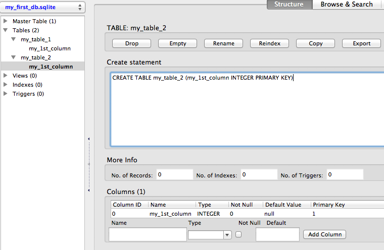
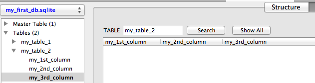
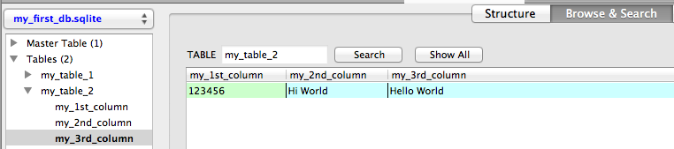
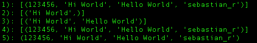
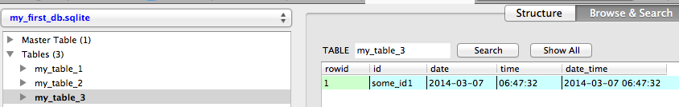
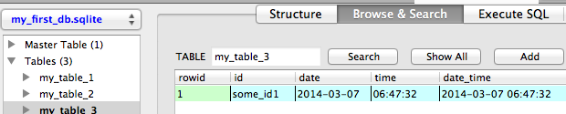
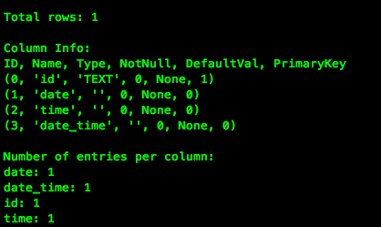

## A thorough guide to SQLite database operations in Python

_\-- written by Sebastian Raschka_ on March 7, 2014

  
  

  
  

* * *

#### Sections

• Connecting to an SQLite database  
• Creating a new SQLite database  
      - Overview of SQLite data types  
      - A quick word on PRIMARY KEYS:  
• Adding new columns  
• Inserting and updating rows  
• Creating unique indexes  
• Querying the database - Selecting rows  
• Security and injection attacks  
• Date and time operations  
• Printing a database summary  
• Conclusion  

The complete Python code that I am using in this tutorial can be downloaded
from my GitHub repository: [https://github.com/rasbt/python_reference/tree/master/tutorials/sqlite3_howto](https://github.com/rasbt/python_reference/tree/master/tutorials/sqlite3_howto)  
  

* * *

  

## Connecting to an SQLite database

The sqlite3 that we will be using throughout this tutorial is part of the
Python Standard Library and is a nice and easy interface to SQLite databases:
There are no server processes involved, no configurations required, and no
other obstacles we have to worry about.

In general, the only thing that needs to be done before we can perform any
operation on a SQLite database via Python's `sqlite3` module, is to open a
connection to an SQLite database file:

    
    
    import sqlite3
    conn = sqlite3.connect(sqlite_file)
    c = conn.cursor()
    

where the database file (`sqlite_file`) can reside anywhere on our disk, e.g.,

    
    
    sqlite_file = '/Users/Sebastian/Desktop/my_db.sqlite' 
    

Conveniently, a new database file (`.sqlite` file) will be created
automatically the first time we try to connect to a database. However, we have
to be aware that it won't have a table, yet. In the following section, we will
take a look at some example code of how to create a new SQLite database files
with tables for storing some data.

To round up this section about connecting to a SQLite database file, there are
two more operations that are worth mentioning. If we are finished with our
operations on the database file, we have to close the connection via the
`.close()` method:

    
    
    conn.close()
    

And if we performed any operation on the database other than sending queries,
we need to commit those changes via the `.commit()` method before we close the
connection:

    
    
    conn.commit()
    conn.close()
    

  

## Creating a new SQLite database

Let us have a look at some example code to create a new SQLite database file
with two tables: One with and one without a PRIMARY KEY column (don't worry,
there is more information about PRIMARY KEYs further down in this section).

    
    
    import sqlite3
    
    sqlite_file = 'my_first_db.sqlite'    # name of the sqlite database file
    table_name1 = 'my_table_1'  # name of the table to be created
    table_name2 = 'my_table_2'  # name of the table to be created
    new_field = 'my_1st_column' # name of the column
    field_type = 'INTEGER'  # column data type
    
    # Connecting to the database file
    conn = sqlite3.connect(sqlite_file)
    c = conn.cursor()
    
    # Creating a new SQLite table with 1 column
    c.execute('CREATE TABLE {tn} ({nf} {ft})'\
            .format(tn=table_name1, nf=new_field, ft=field_type))
    
    # Creating a second table with 1 column and set it as PRIMARY KEY
    # note that PRIMARY KEY column must consist of unique values!
    c.execute('CREATE TABLE {tn} ({nf} {ft} PRIMARY KEY)'\
            .format(tn=table_name2, nf=new_field, ft=field_type))
    
    # Committing changes and closing the connection to the database file
    conn.commit()
    conn.close()
    

Download the script: [create_new_db.py](https://github.com/rasbt/python_reference/blob/master/tutorials/sqlite3_howto/code/create_new_db.py)

* * *

**Tip:** A handy tool to visualize and access SQLite databases is the free FireFox [SQLite Manager](https://addons.mozilla.org/en-US/firefox/addon/sqlite-manager/?src) add-on. Throughout this article, I will use this tool to provide screenshots of the database structures that we created below the corresponding code sections.

* * *

  
  

  
  
Using the code above, we created a new `.sqlite` database file with 2 tables.
Each table consists of currently one column only, which is of type INTEGER.

  

* * *

**Here is a quick overview of all data types that are supported by SQLite 3:**

  * INTEGER: A signed integer up to 8 bytes depending on the magnitude of the value.
  * REAL: An 8-byte floating point value.
  * TEXT: A text string, typically UTF-8 encoded (depending on the database encoding).
  * BLOB: A blob of data (binary large object) for storing binary data.
  * NULL: A NULL value, represents missing data or an empty cell.

* * *

Looking at the table above, You might have noticed that SQLite 3 has no
designated Boolean data type. However, this should not be an issue, since we
could simply re-purpose the INTEGER type to represent Boolean values (0 =
false, 1 = true).

  

**A quick word on PRIMARY KEYS:**  
In our example code above, we set our 1 column in the second table to PRIMARY
KEY. The advantage of a PRIMARY KEY index is a significant performance gain if
we use the PRIMARY KEY column as query for accessing rows in the table. Every
table can only have max. 1 PRIMARY KEY (single or multiple column(s)), and the
values in this column MUST be unique! But more on column indexing in the a
later section.

  

## Adding new columns

If we want to add a new column to an existing SQLite database table, we can
either leave the cells for each row empty (NULL value), or we can set a
default value for each cell, which is pretty convenient for certain
applications.  
Let's have a look at some code:

    
    
    import sqlite3
    
    sqlite_file = 'my_first_db.sqlite'    # name of the sqlite database file
    table_name = 'my_table_2'   # name of the table to be created
    id_column = 'my_1st_column' # name of the PRIMARY KEY column
    new_column1 = 'my_2nd_column'  # name of the new column
    new_column2 = 'my_3nd_column'  # name of the new column
    column_type = 'TEXT' # E.g., INTEGER, TEXT, NULL, REAL, BLOB
    default_val = 'Hello World' # a default value for the new column rows
    
    # Connecting to the database file
    conn = sqlite3.connect(sqlite_file)
    c = conn.cursor()
    
    # A) Adding a new column without a row value
    c.execute("ALTER TABLE {tn} ADD COLUMN '{cn}' {ct}"\
            .format(tn=table_name, cn=new_column1, ct=column_type))
    
    # B) Adding a new column with a default row value
    c.execute("ALTER TABLE {tn} ADD COLUMN '{cn}' {ct} DEFAULT '{df}'"\
            .format(tn=table_name, cn=new_column2, ct=column_type, df=default_val))
    
    # Committing changes and closing the connection to the database file
    conn.commit()
    conn.close()
    

Download the script: [add_new_column.py](https://github.com/rasbt/python_reference/blob/master/tutorials/sqlite3_howto/code/add_new_column.py)

  
  
  
  

We just added 2 more columns (`my_2nd_column` and `my_3rd_column`) to
`my_table_2` of our SQLite database next to the PRIMARY KEY column
`my_1st_column`.  
The difference between the two new columns is that we initialized
`my_3rd_column` with a default value (here:'Hello World'), which will be
inserted for every existing cell under this column and for every new row that
we are going to add to the table if we don't insert or update it with a
different value.

  

## Inserting and updating rows

Inserting and updating rows into an existing SQLite database table - next to
sending queries - is probably the most common database operation. The
Structured Query Language has a convenient `UPSERT` function, which is
basically just a merge between UPDATE and INSERT: It inserts new rows into a
database table with a value for the PRIMARY KEY column if it does not exist
yet, or updates a row for an existing PRIMARY KEY value. Unfortunately, this
convenient syntax is not supported by the more compact SQLite database
implementation that we are using here. However, there are some workarounds.
But let us first have a look at the example code:

    
    
    import sqlite3
    
    sqlite_file = 'my_first_db.sqlite'
    table_name = 'my_table_2'
    id_column = 'my_1st_column'
    column_name = 'my_2nd_column'
    
    # Connecting to the database file
    conn = sqlite3.connect(sqlite_file)
    c = conn.cursor()
    
    # A) Inserts an ID with a specific value in a second column 
    try:
        c.execute("INSERT INTO {tn} ({idf}, {cn}) VALUES (123456, 'test')".\
            format(tn=table_name, idf=id_column, cn=column_name))
    except sqlite3.IntegrityError:
        print('ERROR: ID already exists in PRIMARY KEY column {}'.format(id_column))
    
    # B) Tries to insert an ID (if it does not exist yet)
    # with a specific value in a second column 
    c.execute("INSERT OR IGNORE INTO {tn} ({idf}, {cn}) VALUES (123456, 'test')".\
            format(tn=table_name, idf=id_column, cn=column_name))
    
    # C) Updates the newly inserted or pre-existing entry            
    c.execute("UPDATE {tn} SET {cn}=('Hi World') WHERE {idf}=(123456)".\
            format(tn=table_name, cn=column_name, idf=id_column))
    
    conn.commit()
    conn.close()
    

Download the script: [update_or_insert_records.py](code/update_or_insert_records.py)  
  
  
  
Both A) `INSERT` and B) `INSERT OR IGNORE` have in common that they append new
rows to the database if a given PRIMARY KEY does not exist in the database
table, yet. However, if we'd try to append a PRIMARY KEY value that is not
unique, a simple `INSERT` would raise an `sqlite3.IntegrityError` exception,
which can be either captured via a try-except statement (case A) or
circumvented by the SQLite call `INSERT OR IGNORE` (case B). This can be
pretty useful if we want to construct an `UPSERT` equivalent in SQLite. E.g.,
if we want to add a dataset to an existing database table that contains a mix
between existing and new IDs for our PRIMARY KEY column.

  

## Creating unique indexes

Just like hashtable-datastructures, indexes function as direct pointers to our
data in a table for a particular column (i.e., the indexed column). For
example, the PRIMARY KEY column would have such an index by default. The
downside of indexes is that every row value in the column must be unique.
However, it is recommended and pretty useful to index certain columns if
possible, since it rewards us with a significant performance gain for the data
retrieval.  
The example code below shows how to add such an unique index to an existing
column in an SQLite database table. And if we should decide to insert non-
unique values into a indexed column later, there is also a convenient way to
drop the index, which is also shown in the code below.

    
    
    import sqlite3
    
    sqlite_file = 'my_first_db.sqlite'    # name of the sqlite database file
    table_name = 'my_table_2'   # name of the table to be created
    id_column = 'my_1st_column' # name of the PRIMARY KEY column
    new_column = 'unique_names'  # name of the new column
    column_type = 'TEXT' # E.g., INTEGER, TEXT, NULL, REAL, BLOB
    index_name = 'my_unique_index'  # name for the new unique index
    
    # Connecting to the database file
    conn = sqlite3.connect(sqlite_file)
    c = conn.cursor()
    
    # Adding a new column and update some record
    c.execute("ALTER TABLE {tn} ADD COLUMN '{cn}' {ct}"\
            .format(tn=table_name, cn=new_column, ct=column_type))
    c.execute("UPDATE {tn} SET {cn}='sebastian_r' WHERE {idf}=123456".\
            format(tn=table_name, idf=id_column, cn=new_column))
    
    # Creating an unique index
    c.execute('CREATE INDEX {ix} on {tn}({cn})'\
            .format(ix=index_name, tn=table_name, cn=new_column))
    
    # Dropping the unique index
    # E.g., to avoid future conflicts with update/insert functions
    c.execute('DROP INDEX {ix}'.format(ix=index_name))
    
    # Committing changes and closing the connection to the database file
    conn.commit()
    conn.close()
    

Download the script: [create_unique_index.py](code/create_unique_index.py)  
  
  
  

  

## Querying the database - Selecting rows

After we learned about how to create and modify SQLite databases, it's about
time for some data retrieval. The code below illustrates how we can retrieve
row entries for all or some columns if they match certain criteria.

    
    
    import sqlite3
    
    sqlite_file = 'my_first_db.sqlite'    # name of the sqlite database file
    table_name = 'my_table_2'   # name of the table to be queried
    id_column = 'my_1st_column'
    some_id = 123456
    column_2 = 'my_2nd_column'
    column_3 = 'my_3rd_column'    
    
    # Connecting to the database file
    conn = sqlite3.connect(sqlite_file)
    c = conn.cursor()
    
    # 1) Contents of all columns for row that match a certain value in 1 column
    c.execute('SELECT * FROM {tn} WHERE {cn}="Hi World"'.\
            format(tn=table_name, cn=column_2))
    all_rows = c.fetchall()
    print('1):', all_rows)
    
    # 2) Value of a particular column for rows that match a certain value in column_1 
    c.execute('SELECT ({coi}) FROM {tn} WHERE {cn}="Hi World"'.\
            format(coi=column_2, tn=table_name, cn=column_2))
    all_rows = c.fetchall()
    print('2):', all_rows)
    
    # 3) Value of 2 particular columns for rows that match a certain value in 1 column
    c.execute('SELECT {coi1},{coi2} FROM {tn} WHERE {coi1}="Hi World"'.\
            format(coi1=column_2, coi2=column_3, tn=table_name, cn=column_2))
    all_rows = c.fetchall()
    print('3):', all_rows)
    
    # 4) Selecting only up to 10 rows that match a certain value in 1 column
    c.execute('SELECT * FROM {tn} WHERE {cn}="Hi World" LIMIT 10'.\
            format(tn=table_name, cn=column_2))
    ten_rows = c.fetchall()
    print('4):', ten_rows)
    
    # 5) Check if a certain ID exists and print its column contents
    c.execute("SELECT * FROM {tn} WHERE {idf}={my_id}".\
            format(tn=table_name, cn=column_2, idf=id_column, my_id=some_id))
    id_exists = c.fetchone()
    if id_exists:
        print('5): {}'.format(id_exists))
    else:
        print('5): {} does not exist'.format(some_id))
    
    # Closing the connection to the database file
    conn.close()
    

Download the script: [selecting_entries.py](code/selecting_entries.py)  
  

  
  
if we use the `.fetchall()` method, we return a list of tuples from the
database query, where each tuple represents one row entry. The print output
for the 5 different cases shown in the code above would look like this (note
that we only have a table with 1 row here):  
  
  
  

  

## Security and injection attacks

So far, we have been using Python's string formatting method to insert
parameters like table and column names into the `c.execute()` functions. This
is fine if we just want to use the database for ourselves. However, this
leaves our database vulnerable to injection attacks. For example, if our
database would be part of a web application, it would allow hackers to
directly communicate with the database in order to bypass login and password
verification and steal data.  
In order to prevent this, it is recommended to use `?` place holders in the
SQLite commands instead of the `%` formatting expression or the `.format()`
method, which we have been using in this tutorial.  
For example, instead of using

    
    
    # 5) Check if a certain ID exists and print its column contents
    c.execute("SELECT * FROM {tn} WHERE {idf}={my_id}".\
            format(tn=table_name, cn=column_2, idf=id_column, my_id=some_id))
    

in the Querying the database - Selecting rows section above, we would want to
use the `?` placeholder for the queried column value and include the
variable(s) (here: `123456`), which we want to insert, as tuple at the end of
the `c.execute()` string.

    
    
    # 5) Check if a certain ID exists and print its column contents
    c.execute("SELECT * FROM {tn} WHERE {idf}=?".\
            format(tn=table_name, cn=column_2, idf=id_column), (123456,))   
    

However, the problem with this approach is that it would only work for values,
not for column or table names. So what are we supposed to do with the rest of
the string if we want to protect ourselves from injection attacks? The easy
solution would be to refrain from using variables in SQLite queries whenever
possible, and if it cannot be avoided, we would want to use a function that
strips all non-alphanumerical characters from the stored content of the
variable, e.g.,

    
    
    def clean_name(some_var):
        return ''.join(char for char in some_var if char.isalnum())
    

  

## Date and time operations

SQLite inherited the convenient date and time operations from SQL, which are
one of my favorite features of the Structured Query Language: It does not only
allow us to insert dates and times in various different formats, but we can
also perform simple `+` and `-` arithmetic, for example to look up entries
that have been added xxx days ago.

    
    
    import sqlite3
    
    sqlite_file = 'my_first_db.sqlite'    # name of the sqlite database file
    table_name = 'my_table_3'   # name of the table to be created
    id_field = 'id' # name of the ID column
    date_col = 'date' # name of the date column
    time_col = 'time'# name of the time column
    date_time_col = 'date_time' # name of the date & time column
    field_type = 'TEXT'  # column data type
    
    # Connecting to the database file
    conn = sqlite3.connect(sqlite_file)
    c = conn.cursor()
    
    # Creating a new SQLite table with 1 column
    c.execute('CREATE TABLE {tn} ({fn} {ft} PRIMARY KEY)'\
            .format(tn=table_name, fn=id_field, ft=field_type))
    
    # A) Adding a new column to save date insert a row with the current date 
    # in the following format: YYYY-MM-DD
    # e.g., 2014-03-06
    c.execute("ALTER TABLE {tn} ADD COLUMN '{cn}'"\
             .format(tn=table_name, cn=date_col))
    # insert a new row with the current date and time, e.g., 2014-03-06
    c.execute("INSERT INTO {tn} ({idf}, {cn}) VALUES('some_id1', DATE('now'))"\
             .format(tn=table_name, idf=id_field, cn=date_col))
    
    # B) Adding a new column to save date and time and update with the current time
    # in the following format: HH:MM:SS
    # e.g., 16:26:37
    c.execute("ALTER TABLE {tn} ADD COLUMN '{cn}'"\
             .format(tn=table_name, cn=time_col))
    # update row for the new current date and time column, e.g., 2014-03-06 16:26:37
    c.execute("UPDATE {tn} SET {cn}=TIME('now') WHERE {idf}='some_id1'"\
             .format(tn=table_name, idf=id_field, cn=time_col))
    
    # C) Adding a new column to save date and time and update with current date-time
    # in the following format: YYYY-MM-DD HH:MM:SS
    # e.g., 2014-03-06 16:26:37
    c.execute("ALTER TABLE {tn} ADD COLUMN '{cn}'"\
             .format(tn=table_name, cn=date_time_col))
    # update row for the new current date and time column, e.g., 2014-03-06 16:26:37
    c.execute("UPDATE {tn} SET {cn}=(CURRENT_TIMESTAMP) WHERE {idf}='some_id1'"\
             .format(tn=table_name, idf=id_field, cn=date_time_col))
    
    # The database should now look like this:
    # id         date           time        date_time
    # "some_id1" "2014-03-06"   "16:42:30"  "2014-03-06 16:42:30"
    
    # 4) Retrieve all IDs of entries between 2 date_times
    c.execute("SELECT {idf} FROM {tn} WHERE {cn} BETWEEN '2013-03-06 10:10:10' AND '2015-03-06 10:10:10'".\
        format(idf=id_field, tn=table_name, cn=date_time_col))
    all_date_times = c.fetchall()
    print('4) all entries between ~2013 - 2015:', all_date_times)
    
    # 5) Retrieve all IDs of entries between that are older than 1 day and 12 hrs
    c.execute("SELECT {idf} FROM {tn} WHERE DATE('now') - {dc} >= 1 AND DATE('now') - {tc} >= 12".\
        format(idf=id_field, tn=table_name, dc=date_col, tc=time_col))
    all_1day12hrs_entries = c.fetchall()
    print('5) entries older than 1 day:', all_1day12hrs_entries)
    
    # Committing changes and closing the connection to the database file
    conn.commit()
    conn.close()
    

Download the script: [date_time_ops.py](code/date_time_ops.py)

  
  
  
  

Some of the really convenient functions that return the current time and date
are:

* * *
    
    
    DATE('now') # returns current date, e.g., 2014-03-06
    TIME('now') # returns current time, e.g., 10:10:10
    CURRENT_TIMESTAMP # returns current date and time, e.g., 2014-03-06 16:42:30
    #  (or alternatively: DATETIME('now'))
    

* * *

The screenshot below shows the print outputs of the code that we used to query
for entries that lie between a specified date interval using

    
    
    BETWEEN '2013-03-06 10:10:10' AND '2015-03-06 10:10:10'
    

and entries that are older than 1 day via

    
    
    WHERE DATE('now') - some_date
    

Note that we don't have to provide the complete time stamps here, the same
syntax applies to simple dates or simple times only, too.  
  
  
  

  

#### Update Mar 16, 2014:

  
If'd we are interested to calulate the hours between two `DATETIME()`
timestamps, we can could use the handy `STRFTIME()` function like this  
  

    
    
    SELECT (STRFTIME('%s','2014-03-14 14:51:00') - STRFTIME('%s','2014-03-16 14:51:00'))  
     / -3600
    

  
which would calculate the difference in hours between two dates in this
particular example above (here: `48`) in this case.  
And to calculate the difference in hours between the current `DATETIME` and a
given `DATETIME` string, we could use the following SQLite syntax:  
  

    
    
    SELECT (STRFTIME('%s',DATETIME('now')) - STRFTIME('%s','2014-03-15 14:51:00')) / 3600
    

  

## Retrieving column names

In the previous two sections we have seen how we query SQLite databases for
data contents. Now let us have a look at how we retrieve its metadata (here:
column names):

    
    
    import sqlite3
    
    sqlite_file = 'my_first_db.sqlite'
    table_name = 'my_table_3'
    
    # Connecting to the database file
    conn = sqlite3.connect(sqlite_file)
    c = conn.cursor()
    
    # Retrieve column information
    # Every column will be represented by a tuple with the following attributes:
    # (id, name, type, notnull, default_value, primary_key)
    c.execute('PRAGMA TABLE_INFO({})'.format(table_name))
    
    # collect names in a list
    names = [tup[1] for tup in c.fetchall()]
    print(names)
    # e.g., ['id', 'date', 'time', 'date_time']
    
    # Closing the connection to the database file
    conn.close()
    

Download the script: [get_columnnames.py](code/get_columnnames.py)  
  
  
  
Since we haven't created a PRIMARY KEY column for `my_table_3`, SQLite
automatically provides an indexed `rowid` column with unique ascending integer
values, which will be ignored in our case. Using the `PRAGMA TABLE_INFO()`
function on our table, we return a list of tuples, where each tuple contains
the following information about every column in the table: `(id, name, type,
notnull, default_value, primary_key)`.  
So, in order to get the names of every column in our table, we only have to
grab the 2nd value in each tuple of the returned list, which can be done by

    
    
    names = [tup[1] for tup in c.fetchall()]

after the `PRAGMA TABLE_INFO()` call. If we would print the contents of the
variable `names` now, the output would look like this:  
  
  
  

  

## Printing a database summary

I hope we covered most of the basics about SQLite database operations in the
previous sections, and by now we should be well equipped to get some serious
work done using SQLite in Python.  
Let me conclude this tutorial with an obligatory "last but not least" and a
convenient script to print a nice overview of SQLite database tables:

    
    
    import sqlite3

    def connect(sqlite_file):
        """ Make connection to an SQLite database file """
        conn = sqlite3.connect(sqlite_file)
        c = conn.cursor()
        return conn, c

    def close(conn):
        """ Commit changes and close connection to the database """
        # conn.commit()
        conn.close()

    def total_rows(cursor, table_name, print_out=False):
        """ Returns the total number of rows in the database """
        cursor.execute('SELECT COUNT(*) FROM {}'.format(table_name))
        count = cursor.fetchall()
        if print_out:
            print('\nTotal rows: {}'.format(count[0][0]))
        return count[0][0]

    def table_col_info(cursor, table_name, print_out=False):
        """ Returns a list of tuples with column informations:
        (id, name, type, notnull, default_value, primary_key)
        """
        cursor.execute('PRAGMA TABLE_INFO({})'.format(table_name))
        info = cursor.fetchall()

        if print_out:
            print("\nColumn Info:\nID, Name, Type, NotNull, DefaultVal, PrimaryKey")
            for col in info:
                print(col)
        return info

    def values_in_col(cursor, table_name, print_out=True):
        """ Returns a dictionary with columns as keys
        and the number of not-null entries as associated values.
        """
        cursor.execute('PRAGMA TABLE_INFO({})'.format(table_name))
        info = cursor.fetchall()
        col_dict = dict()
        for col in info:
            col_dict[col[1]] = 0
        for col in col_dict:
            c.execute('SELECT ({0}) FROM {1} '
                      'WHERE {0} IS NOT NULL'.format(col, table_name))
            # In my case this approach resulted in a
            # better performance than using COUNT
            number_rows = len(c.fetchall())
            col_dict[col] = number_rows
        if print_out:
            print("\nNumber of entries per column:")
            for i in col_dict.items():
                print('{}: {}'.format(i[0], i[1]))
        return col_dict

    if __name__ == '__main__':

        sqlite_file = 'my_first_db.sqlite'
        table_name = 'my_table_3'

        conn, c = connect(sqlite_file)
        total_rows(c, table_name, print_out=True)
        table_col_info(c, table_name, print_out=True)
        # next line might be slow on large databases
        values_in_col(c, table_name, print_out=True)

        close(conn)

Download the script: [print_db_info.py](code/print_db_info.py)  
  
  
  

  

## Conclusion

I really hope this tutorial was helpful to you to get started with SQLite
database operations via Python. I have been using the `sqlite3` module a lot
recently, and it has found its way into most of my programs for larger data
analyses.  
Currently, I am working on a novel drug screening software that requires me to
store 3D structures and other functional data for ~13 million chemical
compounds, and SQLite has been an invaluable part of my program to quickly
store, query, analyze, and share my data.  
Another smaller project that uses `sqlite3` in Python would be smilite, a
module to retrieve and compare SMILE strings of chemical compounds from the
free ZINC online database. If you are interested, you can check it out at:
<https://github.com/rasbt/smilite>.  
  
If you have any suggestions or questions, please don't hesitate to write me an
[ email](mailto:se.raschka@gmail.com) or leave a comment in the comment
section below! I am looking forward to your opinions and ideas, and I hope I
can improve and extend this tutorial in future.
