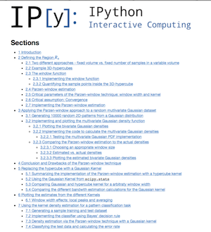
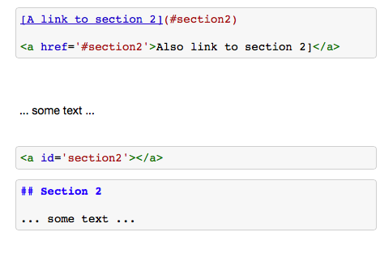
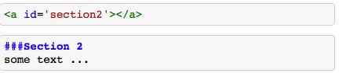
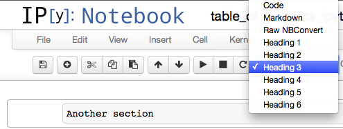

[Sebastian Raschka](http://sebastianraschka.com)  
last updated: 05/18/2014

- [Link to this IPython Notebook on Github](https://github.com/rasbt/One-Python-benchmark-per-day/blob/master/ipython_nbs/day4_2_cython_numba_parakeet.ipynb)  
- [Link to the GitHub Repository One-Python-benchmark-per-day](https://github.com/rasbt/One-Python-benchmark-per-day)

I would be happy to hear your comments and suggestions.  
Please feel free to drop me a note via
[twitter](https://twitter.com/rasbt), [email](mailto:bluewoodtree@gmail.com), or [google+](https://plus.google.com/118404394130788869227).

# Creating a table of contents with internal links in IPython Notebooks and Markdown documents

**Many people have asked me how I create the table of contents with internal links for my IPython Notebooks and Markdown documents on GitHub.   
Well, no (IPython) magic is involved, it is just a little bit of HTML, but I thought it might be worthwhile to write this little how-to tutorial.**

 
 
For example, [click this link](#bottom) to jump to the bottom of the page.
 
 

 
 

## The two components to create an internal link

So, how does it work?  Basically, all you need are those two components:    
1. the destination  
2. an internal hyperlink to the destination  

 
###1. The destination

To define the destination (i.e., the section on the page or the cell you want to jump to), you just need to insert an empty HTML anchor tag and give it an **`id`**,   
e.g., **``**  

This anchor tag will be invisible if you render it as Markdown in the IPython Notebook.  
Note that it would also work if we use the **`name`** attribute instead of **`id`**, but since the **`name`** attribute is not supported by HTML5 anymore, I would suggest to just use the **`id`** attribute, which is also shorter to type.

 
###2. The internal hyperlink

Now we have to create the hyperlink to the **``** anchor tag that we just created.  
We can either do this in ye goode olde HTML where we put a fragment identifier in form of a hash mark (`#`) in front of the name,   
for example,  **`<a href='#the_destination'>Link to the destination'</a>`**

Or alternatively, we can just use the slightly more convenient Markdown syntax:  
**`[Link to the destination](#the_destination)`**

**That's all!**

 
 

## One more piece of advice

Of course it would make sense to place the empty anchor tags for you table of contents just on top of each cell that contains a heading.  
E.g.,   

``  
`###Section 2`  
`some text ...`  

And I did this for a very long time ... until I figured out that it wouldn't render the Markdown properly if you convert the IPython Notebook into HTML (for example, for printing via the print preview option).  

But instead of 

###Section 2

it would be rendered as

`###Section 2`

which is certainly not what we want (note that it looks normal in the IPython Notebook, but not in the converted HTML version). So my favorite remedy would be to put the `id`-anchor tag into a separate cell just above the section, ideally with some line breaks for nicer visuals.

 
 

### Solution 1: id-anchor tag in a separate cell

 
 
 
 
 

### Solution 2: using header cells

To define the hyperlink anchor tag to this "header cell" is just the text content of the "header cell" connected by dashes. E.g.,

`[link to another section](#Another-section)`
 
 
 
 
 
 

[[Click this link and jump to the top of the page](#top)]

You can't see it, but this cell contains a  
``  
anchor tag just below this text.

